<div class="MCWHeader1">
SAP HANA on Azure
</div>

<div class="MCWHeader2">
Hands-on lab step-by-step
</div>

<div class="MCWHeader3">
December 2017
</div>


Information in this document, including URL and other Internet Web site references, is subject to change without notice. Unless otherwise noted, the example companies, organizations, products, domain names, e-mail addresses, logos, people, places, and events depicted herein are fictitious, and no association with any real company, organization, product, domain name, e-mail address, logo, person, place or event is intended or should be inferred. Complying with all applicable copyright laws is the responsibility of the user. Without limiting the rights under copyright, no part of this document may be reproduced, stored in or introduced into a retrieval system, or transmitted in any form or by any means (electronic, mechanical, photocopying, recording, or otherwise), or for any purpose, without the express written permission of Microsoft Corporation.

Microsoft may have patents, patent applications, trademarks, copyrights, or other intellectual property rights covering subject matter in this document. Except as expressly provided in any written license agreement from Microsoft, the furnishing of this document does not give you any license to these patents, trademarks, copyrights, or other intellectual property.

The names of manufacturers, products, or URLs are provided for informational purposes only and Microsoft makes no representations and warranties, either expressed, implied, or statutory, regarding these manufacturers or the use of the products with any Microsoft technologies. The inclusion of a manufacturer or product does not imply endorsement of Microsoft of the manufacturer or product. Links may be provided to third party sites. Such sites are not under the control of Microsoft and Microsoft is not responsible for the contents of any linked site or any link contained in a linked site, or any changes or updates to such sites. Microsoft is not responsible for webcasting or any other form of transmission received from any linked site. Microsoft is providing these links to you only as a convenience, and the inclusion of any link does not imply endorsement of Microsoft of the site or the products contained therein.

© 2018 Microsoft Corporation. All rights reserved.

Microsoft and the trademarks listed at https://www.microsoft.com/en-us/legal/intellectualproperty/Trademarks/Usage/General.aspx are trademarks of the Microsoft group of companies. All other trademarks are property of their respective owners.

**Contents**

<!-- TOC -->

- [SAP HANA on Azure hands-on lab step-by-step](#sap-hana-on-azure-hands-on-lab-step-by-step)
    - [Abstract and learning objectives](#abstract-and-learning-objectives)
    - [Overview](#overview)
    - [Requirements](#requirements)
    - [Help references](#help-references)
    - [Exercise 1: Provision Azure infrastructure](#exercise-1-provision-azure-infrastructure)
        - [Task 1: Deploy an Azure virtual machine running Windows](#task-1-deploy-an-azure-virtual-machine-running-windows)
        - [Task 2: Create a virtual network subnet for the HANA database tier](#task-2-create-a-virtual-network-subnet-for-the-hana-database-tier)
        - [Task 3: Deploy an Azure Resource Manager QuickStart template](#task-3-deploy-an-azure-resource-manager-quickstart-template)
        - [Task 4: Configure IP settings of Azure VMs running Linux](#task-4-configure-ip-settings-of-azure-vms-running-linux)
    - [Exercise 2: Configure operating system on Azure VMs running Linux](#exercise-2-configure-operating-system-on-azure-vms-running-linux)
        - [Task 1: Connect to Azure Linux VMs and register SUSE Linux Enterprise Server image](#task-1-connect-to-azure-linux-vms-and-register-suse-linux-enterprise-server-image)
        - [Task 2: Add YaST packages, update the Linux operating system, and install HA Extensions](#task-2-add-yast-packages-update-the-linux-operating-system-and-install-ha-extensions)
        - [Task 3: Enable cross-node password-less SSH access](#task-3-enable-cross-node-password-less-ssh-access)
        - [Task 4: Configure name resolution](#task-4-configure-name-resolution)
        - [Task 5: Configure storage](#task-5-configure-storage)
    - [Exercise 3: Configure clustering on Azure VMs running Linux](#exercise-3-configure-clustering-on-azure-vms-running-linux)
        - [Task 1: Configure clustering](#task-1-configure-clustering)
        - [Task 2: Configure corosync](#task-2-configure-corosync)
    - [Exercise 4: Install SAP HANA](#exercise-4-install-sap-hana)
        - [Task 1: Copy installation media to Linux VMs](#task-1-copy-installation-media-to-linux-vms)
        - [Task 2: Run hdblcm on both Linux VMs](#task-2-run-hdblcm-on-both-linux-vms)
    - [Exercise 5: Configure SAP HANA replication](#exercise-5-configure-sap-hana-replication)
        - [Task 1: Create HANA DATA ADMIN user account](#task-1-create-hana-data-admin-user-account)
        - [Task 2: Configure keystore and perform a backup](#task-2-configure-keystore-and-perform-a-backup)
        - [Task 3: Create the primary and the secondary sites](#task-3-create-the-primary-and-the-secondary-sites)
    - [Exercise 6: Configure cluster framework](#exercise-6-configure-cluster-framework)
        - [Task 1: Configure STONITH clustering options](#task-1-configure-stonith-clustering-options)
        - [Task 2: Create an Azure AD application for the STONITH device](#task-2-create-an-azure-ad-application-for-the-stonith-device)
        - [Task 3: Grant permissions to Azure VMs to the service principal of the STONITH app](#task-3-grant-permissions-to-azure-vms-to-the-service-principal-of-the-stonith-app)
        - [Task 4: Configure the STONITH cluster device](#task-4-configure-the-stonith-cluster-device)
        - [Task 5: Create SAPHanaTopology cluster resource agent](#task-5-create-saphanatopology-cluster-resource-agent)
        - [Task 6: Create SAPHana cluster resource agent](#task-6-create-saphana-cluster-resource-agent)
    - [Exercise 7: Test the deployment](#exercise-7-test-the-deployment)
        - [Task 1: Install SAP HANA Studio Administration on the Azure VM running Windows](#task-1-install-sap-hana-studio-administration-on-the-azure-vm-running-windows)
        - [Task 2: Modify Azure Internal Load Balancer configuration](#task-2-modify-azure-internal-load-balancer-configuration)
        - [Task 3: Connect to HANA cluster by using SAP HANA Studio Administration](#task-3-connect-to-hana-cluster-by-using-sap-hana-studio-administration)
        - [Task 4: Connect to HANA cluster by using Hawk](#task-4-connect-to-hana-cluster-by-using-hawk)
        - [Task 5: Test a manual failover (from s03-db-0 to s03-db-1)](#task-5-test-a-manual-failover-from-s03-db-0-to-s03-db-1)
        - [Task 6: Test a migration (from s03-db-1 to s03-db-0)](#task-6-test-a-migration-from-s03-db-1-to-s03-db-0)
        - [Task 7: Test fencing](#task-7-test-fencing)
    - [After the Hands-on lab](#after-the-hands-on-lab)
        - [Task 1: Remove the resource group containing all Azure resources deployed in this lab](#task-1-remove-the-resource-group-containing-all-azure-resources-deployed-in-this-lab)

<!-- /TOC -->

# SAP HANA on Azure hands-on lab step-by-step

## Abstract and learning objectives 

In this hands-on lab, you will step through the implementation of a highly available SAP HANA deployment on Microsoft Azure virtual machines running SUSE Linux Enterprise Server. 

After its completion, you will be able to provision Azure infrastructure components necessary to support highly available SAP HANA deployments, configure Azure virtual machines to support highly available SAP HANA installations, implement SUSE Linux Enterprise clustering, install SAP HANA, configure SAP HANA system replication, and test failover scenarios.

## Overview

In this hands-on lab, you are working with Contoso to develop a process of implementing a highly available deployment of SAP HANA on Azure virtual machines (VMs). Your tasks will include the provisioning of Azure infrastructure components of the deployment, setting up a clustered pair of Azure Linux VMs running SUSE Linux Enterprise Server to support SAP HANA, installing SAP HANA instance on each of the Azure VMs, and configuring SAP HANA system replication between them.

## Requirements

-   A Microsoft Azure subscription

-   A lab computer running Windows 10 or Windows Server 2016 with:

    -   access to Microsoft Azure

    -   access to the SAP HANA installation media (requires an SAP Online Service System account)

    -   an SSH client e.g. PuTTY, available from <https://www.chiark.greenend.org.uk/~sgtatham/putty/latest.html>

    -   WinSCP client available from <https://winscp.net/eng/download.php>

-   SUSE Linux Enterprise Server 60-day free trial subscription (available from <https://www.suse.com/products/sles-for-sap/download/> ) via which you obtain registration code for an evaluation copy of SUSE Linux Enterprise Server for SAP Applications 12 SP3 for x86-64

## Help references

|    |            |
|----------|:-------------:|
| **Description** | **Links** |
| High Availability of SAP HANA on Azure Virtual Machines (VMs) | <https://docs.microsoft.com/en-us/azure/virtual-machines/workloads/sap/sap-hana-high-availability/> |


## Exercise 1: Provision Azure infrastructure

Duration: 30 minutes

In this exercise, you will deploy Azure infrastructure prerequisites for implementing SAP HANA on Azure virtual machines (VMs). This will include creating such resources as an Azure virtual network, Azure VMs in the same availability set, an Azure load balancer, Azure Storage accounts as well as assigning static IPs to each VM. To automate the deployment, you will use an Azure Resource Manager QuickStart template available from <https://github.com/Azure/azure-quickstart-templates/tree/master/sap-3-tier-marketplace-image-multi-sid-db-md>

### Task 1: Deploy an Azure virtual machine running Windows

1.  From the lab computer, start a Web browser, and navigate to the Azure portal at https://portal.azure.com

2.  If prompted, on the **Sign in to your account** page, type in the user name and the password of the work or school or personal Microsoft account with the owner role to the Azure subscription you will be using for this lab, and click **Sign in**

3.  In the Azure portal interface, click **+ Create a resource**

4.  On the **New** blade, click **Compute** and then click **Windows Server 2016 Datacenter**

5.  On the **Basics** blade, specify the following settings, and click **OK**:

    -   Name: **s03-hana-0**

    -   VM disk type: **HDD**

    -   User name: **demouser**

    -   Password: **demo\@pass123**

    -   Confirm password: **demo\@pass123**

    -   Subscription: *the name of your Azure subscription*

    -   Resource group: *create a new resource group named* **hana-s03-RG**

    -   Location: *The Azure region you identified in the Before the Hands-on Lab section*
    
    -   Already have a Windows license?: **No**

6.  On the **Choose a size** blade, click **View all**. Next, in the list of VM sizes, click **D1\_V2 Standard**. Then, click **Select**.

7.  On the **Settings** blade, specify the following settings, and click **OK**:

    -   Availability zone: **None**
    
    -   Availability set: **None**

    -   Use managed disks: **Yes**

    -   Network: click **(new) hana-s03-RG-vnet**. On the **Create virtual network** blade, specify the following settings, and click **OK**:

        -   Name: **hana-s03-RG-vnet**
        
        -   Address space: **172.16.0.0/20**

        -   Subnet name: **subnet-0**

        -   Subnet address range: **172.16.0.0/24**

    -   Subnet: **subnet-0 (172.16.0.0/24)**

    -   Public IP address: *accept the default value*

    -   Network security group: **Basic**
    
    -   Select public inbound ports: **RDP (3389)**

    -   Extensions: **No extension**

    -   Auto-shutdown: **Off**

    -   Boot diagnostics: **Disabled**

    -   Guest OS diagnostics: **Disabled**
    
    -   Register with Azure Active Directory: **No**
    
    -   Backup: **Disabled**

8.  On the **Summary** blade, click **Create**

9.  Wait for the deployment to complete. This should take a few minutes.

### Task 2: Create a virtual network subnet for the HANA database tier

1.  In the Azure portal, navigate to the **hana-s03-RG** resource group

2.  On the **hana-s03-RG** resource group blade, in the list of resources, click **hana-s03-RG-vnet**

3.  On the **hana-s03-RG-vnet** blade, click **Subnets**

4.  On the **hana-s03-RG-vnet - Subnets** blade, click **+ Subnet**

5.  On the **Add subnet** blade, specify the following, and click **OK**:

    -   Name: **subnet-1**

    -   Address range: **172.16.1.0/24**

    -   Network security group: **None**

    -   Route table: **None**

    -   Service endpoints: **0 selected**

### Task 3: Deploy an Azure Resource Manager QuickStart template

1.  From the lab computer, start a Web browser and navigate to <https://github.com/Azure/azure-quickstart-templates/tree/master/sap-3-tier-marketplace-image-multi-sid-db-md>

2.  On the **SAP NetWeaver 3-tier multi SID DB (managed disks)** page, click **Deploy to Azure**

3.  If prompted, on the **Sign in to your account** page, type in the user name and the password of the work or school or personal Microsoft account with the owner role in the Azure subscription you will be using for this lab, and click **Sign in**. The Web browser window should automatically redirect to the Azure portal and display the **SAP NetWeaver 3-tier multi SID DB (managed disks)** blade.

4.  On the **SAP NetWeaver 3-tier multi SID DB (managed disks)** blade, click **Edit template**

5.  On the **Edit template** blade, scroll down to the **"SLES 12 BYOS"** object of the **images** variable, and change the value of the **sku** entry from **12-SP1** to **12-SP3**:

    

6.  On the **Edit template** blade, click **Save**

7.  Back on the **SAP NetWeaver 3-tier multi SID DB (managed disks)** blade, specify the following settings:

    -   Subscription: *the name of your Azure subscription*

    -   Resource group: **hana-s03-RG**

    -   Location: *The Azure region you identified in the Before the Hands-on Lab section*

    -   Sap System Id: **S03**

    -   Os Type: **SLES 12 BYOS**

    -   Db Type: **HANA**

    -   SAP System Size: **Demo**

    -   System Availability: **HA**

    -   Admin Username: **demouser**

    -   Admin Password: **demo\@pass123**
    
    -   Ssh Key Data: leave blank

    -   Subnet id: *To identify the value of the subnet id parameter, run the following three commands from the Cloud Shell's Bash prompt to identify the value to enter here (use the value that ends with* **subnet-1**):
    
    ```
    az network vnet subnet list --resource-group hana-s03-RG --vnet-name hana-s03-RG-vnet --query "[?contains(id,'subnet-1')].{id: id}"
    ```
    -   \_artifacts Location: *accept the default value*

    -   \_artifacts Location SaS Token: *accept the default value*

8.  Enable the checkbox labeled **I agree to the terms and conditions stated above**, and click **Purchase**.

9.  Wait for the deployment to complete. This might take about 10 minutes.

### Task 4: Configure IP settings of Azure VMs running Linux

1.  In the Azure portal, navigate to the **hana-s03-RG** resource group blade

2.  On the **hana-s03-RG** resource group blade, in the list of resources, click **s03-nic-db-0**

3.  On the **s03-nic-db-0** blade, click **IP configurations**

4.  On the **s03-nic-db-0 - IP configurations** blade, click **ipconfig1**

5.  On the **ipconfig1** blade, specify the following settings and click **Save**:

    -   Public IP address settings : **Enabled** (note that in a production environment you would not expose a public IP address)

    -   Public IP address: create a new public IP address resource **s03-pip-db-0** of **Basic** SKU and **Static** assignment

    -   Private IP address settings assignment: **Static**.

    -   Private IP address settings IP address: **172.16.1.10**

        

6.  In the Azure portal, navigate back to the **hana-s03-RG** resource group blade, and click **s03-db-0**

7.  On the **s03-db-0** blade, click **Configure** under the **DNS name** label

8.  In the **DNS name label** text box, type a unique name you will use to connect to the **s03-db-0** Azure VM from your lab computer (the name will be in the format ***custom-name.Azure-region.*cloudapp.azure.com**), and click **Save**

    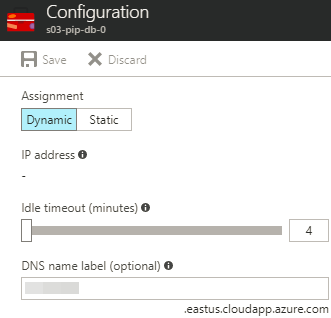

    Now configure equivalent settings for the second Azure Linux VM

9.  On the **hana-s03-RG** resource group blade, in the list of resources, click **s03-nic-db-1**

10. On the **s03-nic-db-1** blade, click **IP configurations**

11. On the **s03-nic-db-1 - IP configurations** blade, click **ipconfig1**

12. On the **ipconfig1** blade, specify the following settings and click **Save**:

    -   Public IP address settings : **Enabled** (note that in a production environment you would not expose a public IP address)

    -   Public IP address: create a new public IP address resource **s03-pip-db-1** of **Basic** SKU and **Static** assignment

    -   Private IP address settings assignment: **Static**

    -   Private IP address settings IP address: **172.16.1.11**
    
        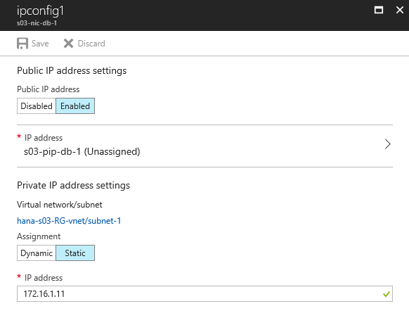

13. In the Azure portal, navigate back to the **hana-s03-RG** resource group blade, and click **s03-db-1**

14. On the **s03-db-1** blade, click **Configure** under the **DNS name** label

15. In the **DNS name label** text box, type a unique name you will use to connect to the **s03-db-1** Azure VM from your lab computer (the name will be in the format ***custom-name.Azure-region.*cloudapp.azure.com**), and click **Save**

    


## Exercise 2: Configure operating system on Azure VMs running Linux

Duration: 30 minutes

In this exercise, you will configure operating system settings on Azure VMs running SUSE Linux Enterprise Server to accommodate subsequent clustered installation of SAP HANA.

### Task 1: Connect to Azure Linux VMs and register SUSE Linux Enterprise Server image

1.  On the lab computer, start the PuTTY client. In the **Host name (or IP address)** text box, type the fully qualified DNS domain name you assigned to the public IP address of the **s03-db-0** Azure VM in Task 4 of Exercise 1. Ensure the **SSH** option is selected, and click **Open**. This will start an SSH session to **s03-db-0**.

    

2.  When prompted, in the **PuTTY Security Alert** dialog box, click **Yes**

    

3.  When prompted, login as **demouser** with the password **demo\@pass123**:

    ```
     login as: demouser

     Using keyboard-interactive authentication.

     Password:

     SUSE Linux Enterprise Server 12 SP3 for SAP Applications x86_64 (64-bit)

     Please register this image using your existing SUSE entitlement.

     As "root" (sudo or sudo -i) use either one of the following commands:

      - SUSEConnect --url=https://scc.suse.com  -e company@example.com -r YOUR_CODE

      - yast scc

     to register the instance with SCC

     Without registration this instance does not have access to updates and security fixes.

     If you are using extensions consider to enable the auto-update feature of the extension agent and restarting the service. As root execute:

       - sed -i s/AutoUpdate.Enabled=n/AutoUpdate.Enabled=y/ /etc/waagent.conf

       - rcwaagent restart

     Forum: https://forums.suse.com/forumdisplay.php?93-SUSE-Public-Cloud

     Have a lot of fun...
    ```
    
4.  Elevate privileges by running `sudo -i` and, when prompted, providing the password for the demouser user account: 

    ```
    demouser@s03-db-0:~> sudo -i

    We trust you have received the usual lecture from the local System Administrator. It usually boils down to these three things:

    #1) Respect the privacy of others.

    #2) Think before you type.

    #3) With great power comes great responsibility.

    [sudo] password for demouser: s03-db-0:~ #
    ```

5.  Register the SUSE image by using the trial registration code from your SUSE trial subscription:

    ```
     s03-db-0:~ # SUSEConnect --url=https://scc.suse.com -e your-user-name@your-company-name -r registration-code

     Registered SLES_SAP 12.3 x86_64

     To server: https://scc.suse.com

     Using E-Mail: your-user-name@your-company-name
    ```

6.  Repeat steps 1-5 for **s03-db-1**

### Task 2: Add YaST packages, update the Linux operating system, and install HA Extensions

1.  While connected via an SSH session to s03-db-0, launch YaST:

    ```
     s03-db-0:~ # yast
     ```

2.  In **YaST Control Center**, select **Software -\> Add-On Products** and press **Enter**. This will load **Package Manager**.

    

3.  In the **Package Manager** interface, click **Add**

    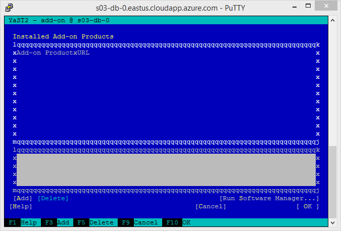

4.  On the **Add on Product** screen, select **Extensions and Modules from Registration Server** -\> **Next**

    

5.  On the **Extension and Module Selection** screen, select **Public Cloud Module 12 x86\_64**. Then, press **F10 (Next)**.

    

6.  Select **Accept**

    

7.  On the **Automatic Changes** screen, click **OK**

    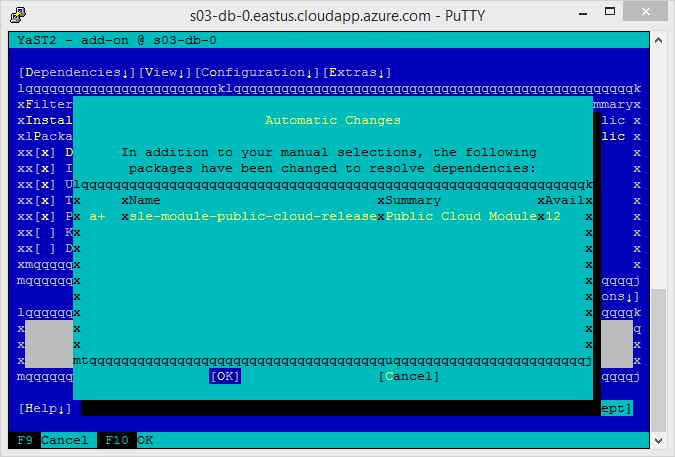

8.  Once the installation has completed, click **Finish**

    

9.  Back in **YaST Control Center,** click **Quit**

    

10. Update operating system by running `zypper update`. When prompted, press `y`:

    ```
     s03-db-0:~ # zypper update

     Refreshing service 'Public_Cloud_Module_12_x86_64'.

     Refreshing service 'SUSE_Linux_Enterprise_Server_for_SAP_Applications_12_SP3_x86_64'.

     Loading repository data...

     Reading installed packages...

     The following 19 NEW packages are going to be installed:

       bash-completion crash-kmp-default gdk-pixbuf-lang grub2-systemd-sleep-plugin

       kernel-default-4.4.92-6.18.1 kernel-firmware liblcms1 libmng1

       libqt5-qtimageformats libqt5-qttranslations libwebp5 libwebpdemux1

       libyui-qt-pkg7 openssh-askpass openssh-helpers plymouth-dracut postfix

       sed-lang systemd-bash-completion

     The following 135 packages are going to be upgraded:

       Mesa Mesa-libEGL1 Mesa-libGL1 Mesa-libglapi0 SuSEfirewall2 at audit autofs

       autoyast2 autoyast2-installation binutils corosync cpp48 ctdb curl cyrus-sasl

       cyrus-sasl-digestmd5 cyrus-sasl-gssapi cyrus-sasl-plain cyrus-sasl-saslauthd

       dbus-1 dbus-1-x11 desktop-data-SLE device-mapper dracut drbd-utils expat

       gdk-pixbuf-query-loaders hyper-v insserv-compat iproute2 iptables

       java-1_7_1-ibm javapackages-tools kexec-tools kpartx krb5 krb5-client

       ldirectord libQt5Core5 libQt5DBus5 libQt5Gui5 libQt5Network5 libQt5Widgets5

       libXvnc1 libaudit1 libauparse0 libcorosync4 libcurl4 libdbus-1-3

       libdcerpc-binding0 libdcerpc0 libexpat1 libfreebl3 libgbm1 libgcrypt20

       libgdk_pixbuf-2_0-0 libicu52_1 libicu52_1-data libiptc0 liblua5_1 libncurses5

       libncurses6 libndr-krb5pac0 libndr-nbt0 libndr-standard0 libndr0 libnetapi0

       libopenssl1_0_0 libpcre1 libpcre16-0 libprocps3 librados2

       libsamba-credentials0 libsamba-errors0 libsamba-hostconfig0 libsamba-passdb0

       libsamba-util0 libsamdb0 libsasl2-3 libsgutils2-2 libsmbconf0 libsmbldap0

       libsoftokn3 libsystemd0 libtevent-util0 libtiff5 libudev1 libvirt-client

       libvirt-libs libwbclient0 libxml2-2 libxtables10 logrotate lsscsi lvm2

       lvm2-clvm lvm2-cmirrord mozilla-nss mozilla-nss-certs multipath-tools

       ncurses-utils netcat-openbsd openssh openssl permissions procps

       python-azure-agent python-pycrypto python-requests release-notes-sles

       resource-agents samba-libs sed sg3_utils shadow supportutils

       supportutils-plugin-suse-public-cloud systemd systemd-sysvinit tcpdump tcsh

       terminfo terminfo-base udev xen-libs xinetd xorg-x11-Xvnc xtables-plugins

       yast2-bootloader yast2-ca-management yast2-packager yast2-sap-scp-prodlist

       yast2-storage yast2-xml

     135 packages to upgrade, 19 new.

     Overall download size: 239.0 MiB. Already cached: 0 B. After the operation,

     additional 376.6 MiB will be used.

     Continue? [y/n/...? shows all options] (y): y

     Retrieving package python-pycrypto-2.6.1-10.3.1.x86_64

    (1/154), 371.8 KiB (  2.0 MiB unpacked)

     (…)
     ```	

11. Update HA extensions dependencies by running `zypper install sle-ha-release fence-agents`. When prompted, press `y`, read through the **SUSE End User License Agreement**, press `q`, type `yes` to agree with the terms of the license, and press **Enter**.

    ```
     s03-db-0:~ # zypper install sle-ha-release fence-agents

     Refreshing service 'Public_Cloud_Module_12_x86_64'.

     Refreshing service 'SUSE_Linux_Enterprise_Server_for_SAP_Applications_12_SP3_x86_64'.

     Loading repository data...

     Reading installed packages...

     'fence-agents' is already installed.

     No update candidate for 'fence-agents-4.0.25+git.1485179354.eb43835-2.19.x86_64'. The highest available version is already installed.

     Resolving package dependencies...

     The following 2 NEW packages are going to be installed:

       sle-ha-release sle-ha-release-POOL

     The following NEW product is going to be installed:

       "SUSE Linux Enterprise High Availability Extension 12 SP3"

     2 new packages to install.

     Overall download size: 7.6 KiB. Already cached: 0 B. After the operation,

     additional 1.7 KiB will be used.

     Continue? [y/n/...? shows all options] (y): y

     Do you agree with the terms of the license? [yes/no] (no): yes

     Retrieving package sle-ha-release-POOL-12.3-1.53.x86_64

    (1/2),   3.1 KiB (   67   B unpacked)

     Retrieving: sle-ha-release-POOL-12.3-1.53.x86_64.rpm .....................[done]

     Retrieving package sle-ha-release-12.3-1.53.x86_64

     (2/2),   4.5 KiB (  1.6 KiB unpacked)

     Retrieving: sle-ha-release-12.3-1.53.x86_64.rpm ..........................[done]

     Checking for file conflicts: .............................................[done]

     (1/2) Installing: sle-ha-release-POOL-12.3-1.53.x86_64 ...................[done]

     (2/2) Installing: sle-ha-release-12.3-1.53.x86_64 ........................[done]

     s03-db-0:~ #
    ```

12. Repeat the steps 1-12 on **s03-db-1**

### Task 3: Enable cross-node password-less SSH access 

1.  From the SSH session on s03-db-0, generate passphrase-less DSA SSH key by running `ssh-keygen -tdsa`. When prompted, press **Enter** three times and then run `cat /root/.ssh/id\_dsa.pub` to display the key.

    ```
     s03-db-0:~ # ssh-keygen -tdsa

     Generating public/private dsa key pair.

     Enter file in which to save the key (/root/.ssh/id_dsa):

     Created directory '/root/.ssh'.

     Enter passphrase (empty for no passphrase):

     Enter same passphrase again:

     Your identification has been saved in /root/.ssh/id_dsa.

     Your public key has been saved in /root/.ssh/id_dsa.pub.

     The key fingerprint is:

     SHA256:d52jKGzQ7o5+z+EqEcwcoD7rxCz3ld8E7+a6izW6+bE root@s03-db-0

     The key's randomart image is:

     +---[DSA 1024]----+
     |    ..           |
     |   .  .          |
     |  .  + .         |
     | .    =.     . . |
     |  o   ..S . . +  |
     | o o  .= + o . . |
     |. *   o.O = .    |
     | = . ..X.@..     |
     |  . ..B*EOB      |
     +----[SHA256]-----+

     s03-db-0:~ # cat /root/.ssh/id_dsa.pub

     ssh-dss AAAAB3NzaC1kc3MAAACBALZjoS47twSwRPzEeCFtCl2QH/Az5m7HC9tJPavdocjx0RG0CBDj qdLiQ7IKrEL0FnupoE7LtVYNxXWN8lO1fEEmi4pJxIknLtKC/UgnSmkmqeZznXPztVZUPoHABw4TX90z Wm9YvrnciAnsMIPUBCe0Kg2ZIo2Z1F3kWmCEw6fhAAAAFQCRunrR7MAH/9RzM57qijQ1El7ybQAAAIEA lHLIvJnwg8czZv5JXIIL6vOO+GRSHNWeCbcw6auBZpJQWIDJQnCdq6kEMYZUXnBcb5QAxYPMMfD9FedU mxxuUJznlh4mnko9V0J4imMl28C8e1Lsjkh9TgH6a7jfB1RDOa8+if0speP2IyDxTuSLexJat8yuzClc lB9LnHu1Ep8AAACAa4ZphhcaCQlELcQao2YKu3br+B56Lj+apafFimLNQeiRY5kZQbAlGtBAVPs5gLpi 3w1kGLzTR3W9WNNwFzw8qpknbQyqSSs0GJmUrwL3PATBkvPn5cUSY+q/ZumCg54a14ooMB00CMQ5Vhup IpHX66hwXbTD9ja+W8XXJXejs8E= root@s03-db-0
    ```

2.  From the SSH session on s03-db-1, generate passphrase-less DSA SSH key by running `ssh-keygen -tdsa`. When prompted, press **Enter** three times and then run `cat /root/.ssh/id\_dsa.pub` to display the key.

    ```
     s03-db-1:~ # ssh-keygen -tdsa

     Generating public/private dsa key pair.

     Enter file in which to save the key (/root/.ssh/id_dsa):

     Enter passphrase (empty for no passphrase):

     Enter same passphrase again:

     Your identification has been saved in /root/.ssh/id_dsa.

     Your public key has been saved in /root/.ssh/id_dsa.pub.

     The key fingerprint is:

     SHA256:tziVIs8+N87mb/HObzVO8vasU83kjtMN9XSiAL0WaDE root@s03-db-1

     The key's randomart image is:

     +---[DSA 1024]----+
     |        E+       |
     |        +.o      |
     |       . . o     |
     |          +.  . =|
     |      . S.+. . B+|
     |       + = .o..oB|
     |        = .  o=*+|
     |       ..o+ ..===|
     |        .*++..=*=|
     +----[SHA256]-----+

     s03-db-1:~ # cat /root/.ssh/id_dsa.pub

     ssh-dss AAAAB3NzaC1kc3MAAACBAMe+HQgU6RFqBK/VjnMIfJ2Qu/ZzGo6zS/Oteb957shR/DjUQsaBy8UFelpXLLmsSJ6FFzHQnA4ri8lGW4/EugmD3536s1Vi6O+zIxaxJF+LNQnKo6xvueLWqQ9sARfKaQgnUrMUusIBY9cxGrsXc3Zfo68NaPPT5aa1JyYdEsENAAAAFQCzyh/ooTuZRqwRI5/T7tFOINhsLwAAAIEAlyG92i4h5KDAZ+ftDnVRZJhLlIg7rJf8kFojr87WQ4PpXnR/zEjI2+UCH2T6Orwdq8J9g7q9dtTO7QWy3Wt9eak5HQA4mpik5ai/u+ftZf0BLuCdDxWVryFhAFg8CO2GYVrWiqCCP7AIAKs56DqQRsUu6twU5MHJ8f//gUjX//8AAACBALuwqBbfEpG0lkLFuczIyWDoKLPZJwjocIYXeVOwdYNWJk/LdQ+D/hv91MJ8GzVhcLUlKFYyCiuRknIjuuOfaEzTuZ+T5Giqvl2xBjkX1ZVMnrBqJSUNXMclem6IVUn0X/M3GqcFrhi5Jk5at26nH46MaYusw0OMCdNynq2aicHt root@s03-db-1
    ```

3.  From the SSH session on s03-db-1, use the vi editor to create and open a file named **/root/.ssh/authorized\_keys**, paste the key you generated on s03-db-0, save your changes, and close the file (by pressing the **Escape** key, typing `:wq!`, and pressing the **Enter** key).

    ```
     s03-db-1:~ # vi /root/.ssh/authorized_keys
    ```
    
4.  From the SSH session on s03-db-0, use the vi editor to create and open a new file:**/root/.ssh/authorized\_keys**, paste the key you generated on s03-db-1 into it, save your changes, and close the file (by pressing the **Escape** key, typing `:wq!`, and pressing the **Enter** key).

    ```
     s03-db-0:~ # vi /root/.ssh/authorized_keys
    ```

5.  From the SSH session on s03-db-0, generate passphrase-less RSA SSH key by running `ssh-keygen`. When prompted, press **Enter** three times and then run `cat /root/.ssh/id\_rsa.pub` to display the key.

    ```
     s03-db-0:~ # ssh-keygen

     Generating public/private dsa key pair.

     Enter file in which to save the key (/root/.ssh/id_dsa):

     Enter passphrase (empty for no passphrase):

     Enter same passphrase again:

     Your identification has been saved in /root/.ssh/id_rsa.

     Your public key has been saved in /root/.ssh/id_rsa.pub.

     The key fingerprint is:

     SHA256:BGv5NCePmzP/aHMr5MhMHe75to/cKUG6RAmzrgicBlY root@s03-db-1

     The key's randomart image is:
     
     +---[RSA 2048]----+
     |  ++             |
     |.+.              |
     |o.+...           |
     |..+*o+ .         |
     |.o+=O . S        |
     |.=X+o+           |
     |**+B+E.          |
     |+**+o.           |
     |.++..            |
     +----[SHA256]-----+

     s03-db-0:~ # cat /root/.ssh/id_dsa.pub

     ssh-rsa AAAAB3NzaC1yc2EAAAADAQABAAABAQDXf3fFwe4qBmyI88xaorItLGXs8wmJsFRg3BaUD/phBE9Hajxu4pzwLIERyBT+DMW8sbXx6OmVe9bONr+s4GLF9fJ8fDcPlJmiGA5SpooaC33c1IxP1Fa0Hsva295rz6AkVSu+yw89aaImxs37bjpId2wvjbjGmWhujdKBsfxNkzrwisr+WnFnyPGD0vtP7pZ0YhNzPgHN/3IlfRfyILtLtFrFaSoQdJWzjt87Sj9C+SqyIR/R++kX2l55/q7zuHNXDQ4W4wVXawNC1NVS3UubgSJnwaBbqqZkF0Ijdu0gyM0hczdRA9mcp/gQ9NFkHYu4GTGLoYT6z2WyV4JyVNtt root@s03-db-0
    ```

6.  From the SSH session on s03-db-1, generate passphrase-less RSA SSH key by running `ssh-keygen`. When prompted, press **Enter** three times and then run `cat /root/.ssh/id\_rsa.pub` to display the key.

    ```
     s03-db-1:~ # ssh-keygen

     Generating public/private dsa key pair.

     Enter file in which to save the key (/root/.ssh/id_dsa):

     Enter passphrase (empty for no passphrase):

     Enter same passphrase again:

     Your identification has been saved in /root/.ssh/id_rsa.

     Your public key has been saved in /root/.ssh/id_rsa.pub.

     The key fingerprint is:

     SHA256:BGv5NCePmzP/aHMr5MhMHe75to/cKUG6RAmzrgicBlY root@s03-db-1

     The key's randomart image is:
     
     +---[RSA 2048]----+
     |      .          |
     |   E   +o        |
     |  .   + =+..     |
     |..   . +.*+ .    |
     |.o .   .S+.+     |
     |  =     oo* .    |
     | . . . ==* o .   |
     |    . . ++Oo+o . |
     |         .oBB=+  |
     +----[SHA256]-----+

     s03-db-1:~ # cat /root/.ssh/id_dsa.pub

     ssh-rsa AAAAB3NzaC1yc2EAAAADAQABAAABAQCyisn1Le0o491/Rw/99W1zuySWmR3iqMeAYG8XwQ5My6wt9zFHdADQwmw3atd5EgpZjlp/DZb7zk4wBgRhVaqLwEFfcmlqoTSdS4CG3oLuM8JJNYdKnD4asngWi98q7/+jwR78HmOZ36VK7+qWKb8l3cecMRsjlDJQF+MRYWknslMRoJgf9O42JG6GcNZ4RtMfq1FZZ8Qy73oKKIydUynSMBtQnPa38g+u/ypxtzv4wsVQL16LWA5UW2XylR9qK3VurZA6wrqfSY9jX1nO8pxaZOnVyPDIgW7EhUgdt95MuL0RWLYCqaHfOeeKDhPwcC3tLyZysZ7dKu2tLbUQJ3kF root@s03-db-1
    ```

7.  From the SSH session on s03-db-1, use the vi editor to open the file named **/root/.ssh/authorized\_keys**, paste the RSA SSH key you generated on s03-db-0 to a new line at the end of the file, save your changes, and close the file (by pressing the **Escape** key, typing `:wq!`, and pressing the **Enter** key).

    ```
     s03-db-1:~ # vi /root/.ssh/authorized_keys
    ```
    
8.  From the SSH session on s03-db-0, use the vi editor to open the file named **/root/.ssh/authorized\_keys**, paste the RSA key you generated on s03-db-1 to a new line at the end of the file, save your changes, and close the file (by pressing the **Escape** key, typing `:wq!`, and pressing the **Enter** key).

    ```
     s03-db-0:~ # vi /root/.ssh/authorized_keys
    ```

9.  From the SSH session on s03-db-0, edit **/etc/ssh/sshd\_config** file:

    ```
     s03-db-0:~ # vi /etc/ssh/sshd_config
    ```

10. In the **/etc/ssh/sshd\_config** file, locate the **PermitRootLogin** and **AuthorizedKeysFile** entries, and configure them as follows (remove the leading **#** character, if present):

    ```
     PermitRootLogin yes

     AuthorizedKeysFile      /root/.ssh/authorized_keys
    ```

11. Save your changes, close the file, and restart sshd daemon by running `systemctl restart sshd`:

    ```
     s03-db-0:/ # systemctl restart sshd
    ```

12.  Repeat steps 9-11 on **s03-db-1**


### Task 4: Configure name resolution

1.  From the SSH session on s03-db-0, add two entries to the **/etc/hosts** file in order to provide name resolution for both hosts within the virtual network:

    ```
    172.16.1.10 s03-db-0
    172.16.1.11 s03-db-1
    ```
    
    ```
     s03-db-1:~ # vi /etc/hosts
    ```

2.  Repeat step 1 on **s03-db-1**


### Task 5: Configure storage 

1.  From the SSH session on s03-db-0, list mounts by running **df -h**:

    ```
     s03-db-0:~ # df -h
     
     Filesystem                            Size  Used Avail Use% Mounted on
     devtmpfs                              2.0G  8.0K  2.0G   1% /dev
     tmpfs                                 2.9G     0  2.9G   0% /dev/shm
     tmpfs                                 2.0G   18M  2.0G   1% /run
     tmpfs                                 2.0G     0  2.0G   0% /sys/fs/cgroup
     /dev/sda2                              29G  2.0G   25G   8% /
     /dev/sdh1                             128G   33M  128G   1% /usr/sap
     /dev/sdd1                             128G   33M  128G   1% /hana/shared
     /dev/sda1                             976M   70M  856M   8% /boot
     /dev/mapper/vg--log-lv--log--0        256G   33M  256G   1% /hana/log
     /dev/mapper/vg--data-lv--data--0      256G   33M  256G   1% /hana/data
     /dev/mapper/vg--backup-lv--backup--0  256G   33M  256G   1% /hana/backup
     /dev/sdb1                              32G   48M   30G   1% /mnt/resource
     tmpfs                                 394M     0  394M   0% /run/user/1000
    ```

2. From the SSH session on s03-db-0, create a directory that will be used to host the SAP HANA installation media by running `mkdir --m 777 /hana/shared/media`

    ```
     s03-db-0:~ # mkdir --m 777 /hana/shared/media
    ```

3. Repeat steps 1-2 on **s03-db-1**

## Exercise 3: Configure clustering on Azure VMs running Linux

Duration: 15 minutes

In this exercise, you will configure clustering on Azure VMs running Linux.

### Task 1: Configure clustering

1.  From the SSH session on **s03-db-0**, run `ha-cluster-init` and follow the prompts:

    -   Do you want to continue anyway (y/n)? **y**
    
    -   csync2 is already configured - overwrite (y/n)? **y**
    
    -   /etc/corosync/authkey already exists - overwrite (y/n)? **y**

    -   Network address to bind to (e.g.: 192.168.1.0) \[172.16.1.0\]: **ENTER**

    -   Multicast address (e.g.: 239.x.x.x) \[239.119.57.183\]: **ENTER**

    -   Multicast port \[5405\]: **ENTER**

    -   Do you wish to use SBD (y/n)?: **n**

    -   Do you wish to configure an administration IP (y/n)?: **n**
    
    ```
     s03-db-0:~ # ha-cluster-init

     ! NTP is not configured to start at system boot.

     ! No watchdog device found. If SBD is used, the cluster will be unable to start without a watchdog.

     Do you want to continue anyway (y/n)? y

       Generating SSH key
       
       Configuring csync2
       
       csync2 is already configured - overwrite (y/n)? y
       
       Generating csync2 shared key (this may take a while)...done
       
       csync2 checking files...done
       
       /etc/corosync/authkey already exists - overwrite (y/n)? y

     Configure Corosync:

       This will configure the cluster messaging layer.  You will need

       to specify a network address over which to communicate (default

       is eth0's network, but you can use the network address of any

       active interface).

       Network address to bind to (e.g.: 192.168.1.0) [172.16.1.0]

       Multicast address (e.g.: 239.x.x.x) [239.119.57.183]


     Configure SBD:

       If you have shared storage, for example a SAN or iSCSI target,

       you can use it avoid split-brain scenarios by configuring SBD.

       This requires a 1 MB partition, accessible to all nodes in the

       cluster.  The device path must be persistent and consistent

       across all nodes in the cluster, so /dev/disk/by-id/* devices

       are a good choice.  Note that all data on the partition you

       specify here will be destroyed.

     Do you wish to use SBD (y/n)? n

     ! Not configuring SBD - STONITH will be disabled.

         Hawk cluster interface is now running. To see cluster status, open:

           https://172.16.1.10:7630/

         Log in with username 'hacluster', password 'linux'

     ! You should change the hacluster password to something more secure!

       Waiting for cluster........done

       Loading initial cluster configuration

     Configure Administration IP Address:

       Optionally configure an administration virtual IP

       address. The purpose of this IP address is to

       provide a single IP that can be used to interact

       with the cluster, rather than using the IP address

       of any specific cluster node.

     Do you wish to configure an administration IP (y/n)? n

       Done (log saved to /var/log/ha-cluster-bootstrap.log)
    ```

2.  From the SSH session on **s03-db-1**, run `ha-cluster-join` and follow the prompts:

    -   Do you want to continue anyway (y/n)? **y**

    -   IP address or hostname of existing node (e.g.: 192.168.1.1) \[\]: **s03-db-0**

    -   /root/.ssh/id\_rsa already exists - overwrite (y/n)? **y**
    
    -   /root/.ssh/id\_dsa already exists - overwrite (y/n)? **y**
        
    ```
     s03-db-1:/ # ha-cluster-join
    
     ! NTP is not configured to start at system boot.

     ! No watchdog device found. If SBD is used, the cluster will be unable to start without a watchdog.

     Do you want to continue anyway (y/n)? y

       Join This Node to Cluster:

       You will be asked for the IP address of an existing node, from which

       configuration will be copied.  If you have not already configured

       passwordless ssh between nodes, you will be prompted for the root

       password of the existing node.
       
       IP address or hostname of existing node (e.g.: 192.168.1.1) []s03-db-0

       Retrieving SSH keys - This may prompt for root@s03-db-0:

     /root/.ssh/id_rsa already exists - overwrite (y/n)? y
     
     /root/.ssh/id_dsa already exists - overwrite (y/n)? y

       2 new SSH keys installed

       Configuring csync2

       Merging known_hosts

       Probing for new partitions...done

     Call cib_query failed (-6): No such device or address

         Hawk cluster interface is now running. To see cluster status, open:

           https://172.16.1.11:7630/

         Log in with username 'hacluster', password 'linux'

     ! You should change the hacluster password to something more secure!

       Waiting for cluster........done

       Done (log saved to /var/log/ha-cluster-bootstrap.log)
    ```

3.  From the SSH session on **s03-db-0**, run **passwd hacluster**, and follow the prompts to change the password of the hacluster account to **demo\@pass123**:

    ```
     s03-db-0:/ # passwd hacluster

     New password:

     Retype new password:

     passwd: password updated successfully
    ```

4.  Repeat step 3 on **s03-db-1**

### Task 2: Configure corosync 

1.  From the SSH session on s03-db-0, modify the **/etc/corosync/corosync.conf** file

    ```
     s03-db-1:~ # vi /etc/corosync/corosync.conf
    ```

2.  Add the following content to the file (add the **transport** entry to the **interface** section and add the entire **nodelist** section):

    ```
     [...]
        interface { 
            [...] 
        }
        transport:      udpu
     } 
     nodelist {
        node {
          ring0_addr:     172.16.1.10
          nodeid:     1
        }
        node {
          ring0_addr:     172.16.1.11 
          nodeid:     2
        } 
     }
      logging {
        [...]
    ```

3.  Save the file, and restart the corosync service by running **service corosync restart**:

    ```
     s03-db-0:/ # service corosync restart
    ```

4.  Repeat steps 1-3 on **s03-db-1**

## Exercise 4: Install SAP HANA

Duration: 60 minutes

In this exercise, you will install SAP HANA.

### Task 1: Copy installation media to Linux VMs

1.  From the lab computer, start WinSCP and connect to the DNS name you assigned to the public IP address of the s03-db-0 Azure VM in Exercise 1 Task 4:

    

2.  When prompted whether to continue, click **Yes**

    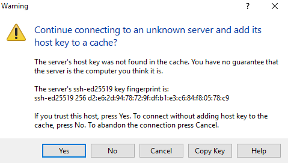

3.  In the left window pane, navigate to the location of the HANA media files on the lab computer. In the right window pane, navigate to the media directory you created on s03-db-0 in Exercise 2 Task 5.

    

4.  Drag the folder containing the installation media files from the left window pane to the right window pane

    

5.  Wait for the copy to complete

    


### Task 2: Run hdblcm on both Linux VMs

1.  From the SSH session on s03-db-0, change the current directory to the location of the media files and set permissions on its content:

    ```
     s03-db-0:/ # cd /hana/shared/media
     s03-db-0:/hana/shared/media/ # chmod -R 744 *
    ```

2.  From the SSH session on s03-db-0, change the current directory to the location of the hdblcm binary:

    ```
     s03-db-0:/hana/shared/media # cd ./DATA_UNITS/HDB_SERVER_LINUX_X86_64
     s03-db-0:/hana/shared/media/DATA_UNITS/HDB_SERVER_LINUX_X86_64 #
    ```

3.  From the SSH session on s03-db-0, run `./hdblcm --hdbinst_server_ignore=check_min_mem` and follow prompts:

    -   Enter selected system index \[3\]: **1**
    
    -   Restrict maximum memory allocation? [n]: *accept the default*

    -   Enter comma-separated list of the selected indices \[3\]: **1**

    -   Enter Installation Path \[/hana/shared\]: *accept the default*

    -   Enter Local Host Name \[s03-db-0\]: *accept the default*

    -   Do you want to add additional hosts to the system? (y/n) \[n\]: *accept the default*

    -   Enter SAP HANA System ID: **S03**

    -   Enter Instance Number \[00\]: *accept the default*

    -   Select Database Mode / Enter Index \[1\]: *accept the default*

    -   Select System Usage / Enter Index \[4\]: **4**

    -   Enter Location of Data Volumes \[/hana/data/S03\]: *accept the default*

    -   Enter Location of Log Volumes \[/hana/log/S03\]: *accept the default*

    -   Enter Certificate Host Name for Host \'s03-db-0\' \[s03-db-0\]: *accept the default*

    -   Enter SAP Host Agent User (sapadm) Password: **demo@pass123**

    -   Confirm SAP Host Agent User (sapadm) Password: **demo@pass123**

    -   Enter System Administrator (s03adm) Password: **demo@pass123**

    -   Confirm System Administrator (s03adm) Password: **demo@pass123**

    -   Enter System Administrator Home Directory \[/usr/sap/S03/home\]: *accept the default*

    -   Enter System Administrator Login Shell \[/bin/sh\]: *accept the default*

    -   Enter System Administrator User ID \[1001\]: *accept the default*

    -   Enter ID of User Group (sapsys) \[79\]: *accept the default*

    -   Enter Database User (SYSTEM) Password: **Demo@pass123**

    -   Confirm Database User (SYSTEM) Password: **Demo@pass123**

    -   Restart system after machine reboot? \[n\]: *accept the default*
    
    -   Enter Installation Path for Address Directories and Reference Data [/hana/shared/S03/global/hdb/IM/reference_data]: *accept the default*
    
    -   Do you want to continue? (y/n): **y**
    
    ```
     s03-db-0:/hana/shared/media/HANA_51051151/DATA_UNITS/HDB_SERVER_LINUX_X86_64 # ./hdblcm

     SAP HANA Lifecycle Management - SAP HANA 1.00.121.00.1466466057

     ***************************************************************

     Scanning Software Locations...

     Detected components:

         SAP HANA Database (1.00.121.00.1466466057) in /hana/shared/media/HANA_51051151/DATA_UNITS/HDB_SERVER_LINUX_X86_64/server

         SAP HANA AFL (incl.PAL,BFL,OFL,HIE) (1.00.121.00.1466480725) in /hana/shared/media/HANA_51051151/DATA_UNITS/HDB_AFL_LINUX_X86_64/packages

         SAP TRD AFL FOR HANA (1.00.121.00.1466480725) in /hana/shared/media/HANA_51051151/DATA_UNITS/HDB_TRD_AFL_LINUX_X86_64/packages

         SAP HANA Database Client (1.00.120.032.1464894911) in /hana/shared/media/HANA_51051151/DATA_UNITS/HDB_CLIENT_LINUX_X86_64/client

         SAP HANA Studio (2.3.6.000000) in /hana/shared/media/HANA_51051151/DATA_UNITS/HDB_STUDIO_LINUX_X86_64/studio

         SAP HANA Smart Data Access (1.00.6.001.0) in /hana/shared/media/HANA_51051151/DATA_UNITS/SAP_HANA_SDA_10_LINUX_X86_64/packages

         SAP HANA XS Advanced Runtime (1.0.28.271025) in /hana/shared/media/HANA_51051151/DATA_UNITS/XSA_RT_10_LINUX_X86_64/packages

         SAP Web Ide 1 (3.012.0) in /hana/shared/media/HANA_51051151/DATA_UNITS/XSAC_SAP_WEB_IDE_10/XSACSAPWEBIDE12_0.ZIP

         DI CORE 1 (3.012.0) in /hana/shared/media/HANA_51051151/DATA_UNITS/XSAC_DI_CORE_10/XSACDEVXDI12_0.ZIP

         XS Monitoring 1 (1.002.0) in /hana/shared/media/HANA_51051151/DATA_UNITS/XSA_CONTENT_10/XSACMONITORING02_0.ZIP

         XS Services 1 (1.002.0) in /hana/shared/media/HANA_51051151/DATA_UNITS/XSA_CONTENT_10/XSACSERVICES02_0.ZIP

         SAP HANA Runtime Tools 1 (1.002.2) in /hana/shared/media/HANA_51051151/DATA_UNITS/XSAC_HRTT_10/XSACHRTT02_2.ZIP

     Choose installation

       Index | System             | Database Properties

       ------------------------------------------------

       1     | Install new system |

             |                    |

       2     | Extract components |

       3     | Exit (do nothing)  |

     Enter selected system index [3]: 1

     SAP HANA Database version '1.00.121.00.1466466057' will be installed.

     Select additional components for installation:

       Index | Components | Description

       -----------------------------------------------------------------------------------------------

       1     | server     | No additional components

       2     | all        | All components

       3     | client     | Install SAP HANA Database Client version 1.00.120.032.1464894911

       4     | afl        | Install SAP HANA AFL (incl.PAL,BFL,OFL,HIE) version 1.00.121.00.1466480725

       5     | smartda    | Install SAP HANA Smart Data Access version 1.00.6.001.0

       6     | studio     | Install SAP HANA Studio version 2.3.6.000000

       7     | trd        | Install SAP TRD AFL FOR HANA version 1.00.121.00.1466480725

       8     | xs         | Install SAP HANA XS Advanced Runtime version 1.0.28.271025

     Enter comma-separated list of the selected indices [3]: 1

     Enter Installation Path [/hana/shared]:

     Enter Local Host Name [s03-db-0]:

     Do you want to add additional hosts to the system? (y/n) [n]:

     Enter SAP HANA System ID: s03

     Invalid SAP HANA System ID

       The first character has to be an upper case letter.

     Enter SAP HANA System ID: S03

     Enter Instance Number [00]:

       Index | Database Mode       | Description

       -----------------------------------------------------------------------------------------------

       1     | single_container    | The system contains one database

       2     | multiple_containers | The system contains one system database and 1..n tenant databases

       Index | System Usage | Description

       -------------------------------------------------------------------------------

       1     | production   | System is used in a production environment

       2     | test         | System is used for testing, not production

       3     | development  | System is used for development, not production

       4     | custom       | System usage is neither production, test nor development

     Select System Usage / Enter Index [4]: 4

     Enter Location of Data Volumes [/hana/data/S03]:

     Enter Location of Log Volumes [/hana/log/S03]:

     Enter Certificate Host Name For Host 's03-db-0' [s03-db-0]:

     Enter SAP Host Agent User (sapadm) Password:

     Confirm SAP Host Agent User (sapadm) Password:

     Enter System Administrator (s03adm) Password:

     Confirm System Administrator (s03adm) Password:

     Password confirmation failed

     Confirm System Administrator (s03adm) Password:

     Enter System Administrator Home Directory [/usr/sap/S03/home]:

     Enter System Administrator Login Shell [/bin/sh]:

     Enter System Administrator User ID [1001]:

     Enter ID of User Group (sapsys) [79]:

     Enter Database User (SYSTEM) Password:

     Confirm Database User (SYSTEM) Password:

     Restart system after machine reboot? [n]:

     Summary before execution:

     =========================

     SAP HANA Components Installation

        Installation Parameters

           Remote Execution: ssh

           Installation Path: /hana/shared

           Local Host Name: s03-db-0

           SAP HANA System ID: S03

           Instance Number: 00

           Database Mode: single_container
           Location of Data Volumes: /hana/data/S03

           Location of Log Volumes: /hana/log/S03


           System Administrator Login Shell: /bin/sh

           System Administrator User ID: 1001

           ID of User Group (sapsys): 79

        Software Components

           SAP HANA Database

              Install version 1.00.121.00.1466466057

              Location: /hana/shared/media/HANA_51051151/DATA_UNITS/HDB_SERVER_LINUX_X86_64/server

           SAP HANA AFL (incl.PAL,BFL,OFL,HIE)

              Do not install

           SAP TRD AFL FOR HANA

              Do not install

           SAP HANA Database Client

              Do not install

           SAP HANA Studio

              Do not install

           SAP HANA Smart Data Access

              Do not install

           SAP HANA XS Advanced Runtime

              Do not install

     Do you want to continue? (y/n): y

     Installing components...

     Installing SAP HANA Database...

       Preparing package 'Saphostagent Setup'...

       Preparing package 'Python Support'...

       Preparing package 'Python Runtime'...

       Preparing package 'Product Manifest'...

       Preparing package 'Binaries'...

       Preparing package 'Data Quality'...

       Preparing package 'Krb5 Runtime'...

       Preparing package 'Installer'...

       Preparing package 'Ini Files'...

       Preparing package 'HWCCT'...

       Preparing package 'Emergency Support Package'...

       Preparing package 'EPM'...

       Preparing package 'Documentation'...

       Preparing package 'Delivery Units'...

       Preparing package 'DAT Languages'...

       Preparing package 'DAT Configfiles'...

       Creating System...

       Extracting software...

       Installing package 'Saphostagent Setup'...

       Installing package 'Python Support'...

       Installing package 'Python Runtime'...

       Installing package 'Product Manifest'...

       Installing package 'Binaries'...

       Installing package 'Data Quality'...

       Installing package 'Krb5 Runtime'...

       Installing package 'Installer'...

       Installing package 'Ini Files'...

       Installing package 'HWCCT'...

       Installing package 'Emergency Support Package'...

       Installing package 'EPM'...

       Installing package 'Documentation'...

       Installing package 'Delivery Units'...

       Installing package 'DAT Languages'...

       Installing package 'DAT Configfiles'...

       Creating instance...

       Starting SAP HANA Database system...

       Starting 7 processes on host 's03-db-0' (worker):

           Starting on 's03-db-0': hdbcompileserver, hdbdaemon, hdbindexserver, hdbnameserver, hdbpreprocessor, hdbwebdispatcher, hdbxsengine

           Starting on 's03-db-0': hdbcompileserver, hdbdaemon, hdbindexserver, hdbpreprocessor, hdbwebdispatcher, hdbxsengine

           Starting on 's03-db-0': hdbdaemon, hdbindexserver, hdbwebdispatcher, hdbxsengine

           Starting on 's03-db-0': hdbdaemon, hdbwebdispatcher, hdbxsengine

           Starting on 's03-db-0': hdbdaemon, hdbwebdispatcher

         All server processes started on host 's03-db-0' (worker).

       Importing delivery units...

       Importing delivery unit HCO_INA_SERVICE

       Importing delivery unit HANA_DT_BASE

       Importing delivery unit HANA_IDE_CORE

       Importing delivery unit HANA_TA_CONFIG

       Importing delivery unit HANA_UI_INTEGRATION_SVC

       Importing delivery unit HANA_UI_INTEGRATION_CONTENT

       Importing delivery unit HANA_XS_BASE

       Importing delivery unit HANA_XS_DBUTILS

       Importing delivery unit HANA_XS_EDITOR

       Importing delivery unit HANA_XS_IDE

       Importing delivery unit HANA_XS_LM

       Importing delivery unit HDC_ADMIN

       Importing delivery unit HDC_BACKUP

       Importing delivery unit HDC_IDE_CORE

       Importing delivery unit HDC_SEC_CP

       Importing delivery unit HDC_XS_BASE

       Importing delivery unit HDC_XS_LM

       Importing delivery unit SAPUI5_1

       Importing delivery unit SAP_WATT

       Importing delivery unit HANA_BACKUP

       Importing delivery unit HANA_HDBLCM

       Importing delivery unit HANA_SEC_BASE

       Importing delivery unit HANA_SEC_CP

       Importing delivery unit HANA_ADMIN

       Importing delivery unit HANA_WKLD_ANLZ

     Installing Resident hdblcm...

     Updating SAP HANA Instance Integration on Local Host...

       Regenerating SSL certificates...

       Deploying SAP Host Agent configurations...

     Creating Component List...

     SAP HANA system installed

     You can send feedback to SAP with this form: https://s03-db-0:1129/lmsl/HDBLCM/S03/feedback/feedback.html

     Log file written to '/var/tmp/hdb_S03_hdblcm_install_2017-11-12_00.07.22/hdblcm.log' on host 's03-db-0'.
    ```

4.  Repeat steps 1-3 on s03-db-1 using the same custom values and accepting the same default values

## Exercise 5: Configure SAP HANA replication 

Duration: 20 minutes

In this exercise, you will configure SAP HANA replication.

### Task 1: Create HANA DATA ADMIN user account

1.  From the SSH session on s03-db-0, change the current directory to the root, and modify the path environment variable to include reference to the HANA binaries
   
   -   **cd /**

   -   **PATH="$PATH:/usr/sap/S03/HDB00/exe"**
 
    ```
     s03-db-0:/hana/shared/media/HANA_51051151/DATA_UNITS/HDB_SERVER_LINUX_X86_64 # cd /

     s03-db-0:/ # PATH="$PATH:/usr/sap/S03/HDB00/exe"
    ```

2.  From the SSH session on s03-db-0, create the s03hasync HANA DATA ADMIN user account (when prompted, provide the password for the HANA DB SYSTEM user which you set in Task2 of Exercise 4 to **Demo\@pass123**):

    -   **hdbsql -u system -i 00 \'CREATE USER s03hasync PASSWORD \"C0mpl3xp\@55w0rd\"\'**

    -   **hdbsql -u system -i 00 \'GRANT DATA ADMIN TO s03hasync\'**

    -   **hdbsql -u system -i 00 \'ALTER USER s03hasync DISABLE PASSWORD LIFETIME\'**
    ```
     s03-db-0:/ # hdbsql -u system -i 00 'CREATE USER s03hasync PASSWORD "C0mpl3xp@55w0rd"'

     Password: 

     0 rows affected (overall time 15.504 msec; server time 14.420 msec)

     s03-db-0:/ # hdbsql -u system -i 00 'GRANT DATA ADMIN TO s03hasync'

     Password:

     0 rows affected (overall time 5163 usec; server time 4054 usec)

     s03-db-0:/ # hdbsql -u system -i 00 'ALTER USER s03hasync DISABLE PASSWORD LIFETIME'

     Password:

     0 rows affected (overall time 4733 usec; server time 3694 usec)
    ```

3.  Repeat step 1 **(but not step 2)** on s03-db-1

### Task 2: Configure keystore and perform a backup

1.  From the SSH session on s03-db-0, configure keystore by running **hdbuserstore SET S03haloc localhost:30015 S03hasync C0mpl3xp\@55w0rd**:

     s03-db-0:/ # hdbuserstore SET S03haloc localhost:30015 S03hasync C0mpl3xp@55w0rd

2.  Repeat step 1 on s03-db-1

3.  From the SSH session on s03-db-0, perform a backup by running **hdbsql -u system -i 00 \"BACKUP DATA USING FILE (\'initialbackup\')\"** (when prompted, provide the password for the HANA DB SYSTEM user which you set in Task2 of Exercise 4 to **Demo\@pass123**):

    ```
     s03-db-0:/ # hdbsql -u system -i 00 "BACKUP DATA USING FILE ('initialbackup')"

     Password:

     0 rows affected (overall time 63.961412 sec; server time 63.960173 sec)
    ```

### Task 3: Create the primary and the secondary sites 

1.  From the SSH session on s03-db-0, switch to the security context of the s03adm account by running **su -- s03adm**:

    ```
     s03-db-0:/ # su - s03adm

     s03adm@s03-db-0:/usr/sap/S03/HDB00>
    ```

2.  From the SSH session on s03-db-0, create the primary site by running **hdbnsutil --sr\_enable ---name=SITE1**:

    ```
     s03adm@s03-db-0:/usr/sap/S03/HDB00> hdbnsutil -sr_enable --name=SITE1

     checking for active nameserver ...

     nameserver is active, proceeding ...

     successfully enabled system as system replication source site

     done.
    ```

3.  From the SSH session on s03-db-1, switch to the security context of the s03adm account by running **su -- s03adm**:

    ```
     s03-db-1:/ # su - s03adm

     s03adm@s03-db-1:/usr/sap/S03/HDB00>
    ```

4.  From the SSH session on s03-db-1, stop the HANA DB instance by running **sapcontrol -nr 00 -function StopWait 600 10**:

    ```
     s03adm@s03-db-1:/usr/sap/S03/HDB00> sapcontrol -nr 00 -function StopWait 600 10

     12.11.2017 01:09:23

     Stop

     OK

     s03adm@s03-db-1:/usr/sap/S03/HDB00>
    ```

5.  From the SSH session on s03-db-1, create the secondary site by running **hdbnsutil -sr\_register \--remoteHost=s03-db-0 \--remoteInstance=00 \--replicationMode=sync \--name=SITE2**:

    ```
     s03adm@s03-db-1:/usr/sap/S03/HDB00> hdbnsutil -sr_register --remoteHost=s03-db-0 --remoteInstance=00 --replicationMode=sync --name=SITE2

     adding site ...

     --operationMode not set; using default from global.ini/[system_replication]/operation_mode: delta_datashipping

     checking for inactive nameserver ...

     nameserver s03-db-1:30001 not responding.

     collecting information ...

     updating local ini files ...

     done.
    ```

## Exercise 6: Configure cluster framework

Duration: 30 minutes

In this exercise, you will configure cluster framework.

### Task 1: Configure STONITH clustering options

1.  From the SSH session on s03-db-0, switch to the privileged mode by typing **exit**:

    ```
     s03adm@s03-db-0:/usr/sap/S03/HDB00> exit

     logout

     s03-db-0:/ #
    ```

2.  From the SSH session on s03-db-0, create a new file named **crm-defaults.txt** with the following content:

    ```
     property $id="cib-bootstrap-options" \
     no-quorum-policy="ignore" \
     stonith-enabled="true" \
     stonith-action="reboot" \
     stonith-timeout="150s"
     rsc_defaults $id="rsc-options" \
     resource-stickiness="1000" \
     migration-threshold="5000"
     op_defaults $id="op-options" \
     timeout="600"
    ```

3.  From the SSH session on s03-db-0, apply the settings in the file by running **crm configure load update ./crm-defaults.txt**

    ```
     s03-db-0:/ # crm configure load update ./crm-defaults.txt
    ```

### Task 2: Create an Azure AD application for the STONITH device

1.  From the lab computer, start **Internet Explorer** and browse to the Azure portal at **https://portal.azure.com**

2.  When prompted, sign in with the account that has the Global Administrator role in the Azure Active Directory tenant associated with your subscription.

3.  In the Azure portal, navigate to the Subscription blade and note the **subscription ID**

    

4.  In the Azure portal, navigate to the Azure Active Directory blade

5.  On the Active Directory blade, click **Properties** and note the value of **Directory ID**. This will be referenced as the tenant id later in the exercise.

    

6.  Click **App registrations** followed by selecting **+New application registration**

    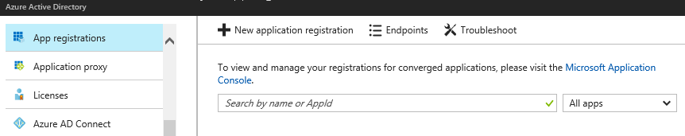

7.  On the **Create** blade, specify the following settings, and click **Create**:

    a.  Name: **Stonith app**

    b.  Application type: **Web app /API**

    c.  Sign-on URL: **http://localhost**

    

8.  On the list of apps, click the newly created app. On the app blade, note the value of **Application ID**. This will be referenced as the login id later in this exercise:

    

9.  Click **Settings** and, on the **Settings** blade, click **Keys**

    

10. On the **Keys** blade, in the **DESCRIPTION** column, type **STONITH app key**. In the **EXPIRES** column, select **Never expires**. Then, click **Save**.

    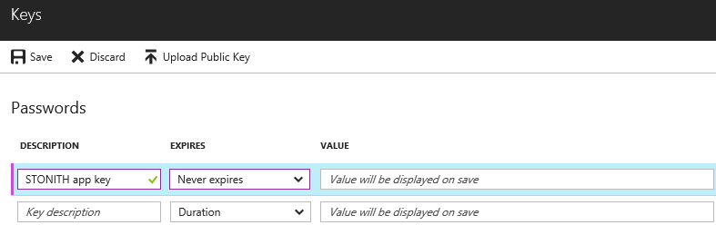

11. Make sure to write down the entry appearing in the **VALUE** column (this entry is displayed only once, after you click **Save**). This will be used as the password for the corresponding service principal.

12. Close the **Keys** blade

### Task 3: Grant permissions to Azure VMs to the service principal of the STONITH app 

1.  In the Azure portal, navigate to the s03-db-0 VM

    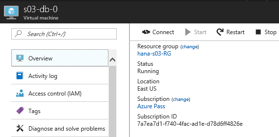

2.  On the s03-db-0 blade, click **Access control (IAM)**

    

3.  Click + **Add**

4.  On the **Add permissions** blade, specify the following settings and click **Save**:

    -   Role: **Owner**

    -   Assign access to: **Azure AD user, group, or application**

    -   Select: **Stonith app**

        

5.  Repeat steps 1 to 4 to assign the Stonith App the Owner role to the s03-db-1 Azure VM

### Task 4: Configure the STONITH cluster device 

1.  From the SSH session on s03-db-0, create a new file named **crm-fencing.txt** with the following content (where *subscription\_id, resource\_group, tenant\_id, login\_id,* and *password* are placeholders for the values you identified in Exercise 5 Task 2:

    ```
     primitive rsc_st_azure_1 stonith:fence_azure_arm \
     params subscriptionId="subscription_id" resourceGroup="hana-s03-RG" tenantId="tenant _id" login="login_id" passwd="password"
     primitive rsc_st_azure_2 stonith:fence_azure_arm \
     params subscriptionId="subscription_id" resourceGroup="hana-s03-RG" tenantId="tenant _id" login="login_id" passwd="password"
     colocation col_st_azure -2000: rsc_st_azure_1:Started rsc_st_azure_2:Started
    ```

2.  From the SSH session on s03-db-0, apply the settings in the file by running **crm configure load update ./crm-fencing.txt**:

    ```
     s03-db-0:/ # crm configure load update ./crm-fencing.txt
    ```

### Task 5: Create SAPHanaTopology cluster resource agent

1.  From the SSH session on s03-db-0, create a new file named **crm-saphanatop.txt** with the following content:

    ```
     primitive rsc_SAPHanaTopology_S03_HDB00 ocf:suse:SAPHanaTopology \
     operations $id="rsc_sap2_S03_HDB00-operations" \
     op monitor interval="10" timeout="600" \
     op start interval="0" timeout="600" \
     op stop interval="0" timeout="300" \
     params SID="S03" InstanceNumber="00"
     clone cln_SAPHanaTopology_S03_HDB00 rsc_SAPHanaTopology_S03_HDB00 \
     meta is-managed="true" clone-node-max="1" target-role="Started" interleave="true"
    ```

2.  From the SSH session on s03-db-0, apply the settings in the file by running **crm configure load update ./crm-saphanatop.txt**:

    ```
     s03-db-0:/ # crm configure load update ./crm-saphanatop.txt
    ```

### Task 6: Create SAPHana cluster resource agent

1.  From the SSH session on s03-db-0, create a new file named **crm-saphana.txt** with the following content:

    ```
     primitive rsc_SAPHana_S03_HDB00 ocf:suse:SAPHana \
     operations $id="rsc_sap_S03_HDB00-operations" \
     op start interval="0" timeout="3600" \
     op stop interval="0" timeout="3600" \
     op promote interval="0" timeout="3600" \
     op monitor interval="60" role="Master" timeout="700" \
     op monitor interval="61" role="Slave" timeout="700" \
     params SID="S03" InstanceNumber="00" PREFER_SITE_TAKEOVER="true" \
     DUPLICATE_PRIMARY_TIMEOUT="7200" AUTOMATED_REGISTER="false"
     ms msl_SAPHana_S03_HDB00 rsc_SAPHana_S03_HDB00 \
     meta is-managed="true" notify="true" clone-max="2" clone-node-max="1" \
     target-role="Started" interleave="true"
     primitive rsc_ip_S03_HDB00 ocf:heartbeat:IPaddr2 \ 
     meta target-role="Started" is-managed="true" \ 
     operations $id="rsc_ip_S03_HDB00-operations" \ 
     op monitor interval="10s" timeout="20s" \ 
     params ip="172.16.1.4" 
     primitive rsc_nc_S03_HDB00 anything \ 
     params binfile="/usr/bin/nc" cmdline_options="-l -k 62500" \ 
     op monitor timeout=20s interval=10 depth=0 
     group g_ip_S03_HDB00 rsc_ip_S03_HDB00 rsc_nc_S03_HDB00
     colocation col_saphana_ip_S03_HDB00 2000: g_ip_S03_HDB00:Started \ 
     msl_SAPHana_S03_HDB00:Master  
     order ord_SAPHana_S03_HDB00 2000: cln_SAPHanaTopology_S03_HDB00 \ 
     msl_SAPHana_S03_HDB00
    ```
    
2.  From the SSH session on s03-db-0, apply the settings in the file by running **crm configure load update ./crm-saphana.txt**:

    ```
     s03-db-0:/ # crm configure load update ./crm-saphana.txt
    ```

## Exercise 7: Test the deployment

Duration: 30 minutes

In this exercise, you will test the HANA deployment.

### Task 1: Install SAP HANA Studio Administration on the Azure VM running Windows

1.  From the Azure portal, establish a Remote Desktop session to the s03-hana-0 Azure VM

2.  Use the drive redirection feature of Remote Desktop session to copy the **DATA\_UNITS\\HDB\_STUDIO\_WINDOWS\_X86\_64** folder from the installation media to the s03-hana-0 Azure VM

3.  From the Remote Desktop session to s03-hana-0 Azure VM, navigate to the **DATA\_UNITS\\HDB\_STUDIO\_WINDOWS\_X86\_64** folder and run **hdbsetup.exe**. This will start the SAP HANA Studio Installation wizard.

    

4.  On the **Define Studio Properties** page, click **Next**

    

5.  On the **Select Features** page, ensure that only **SAP HANA Studio Administration** is selected, and click **Next**

    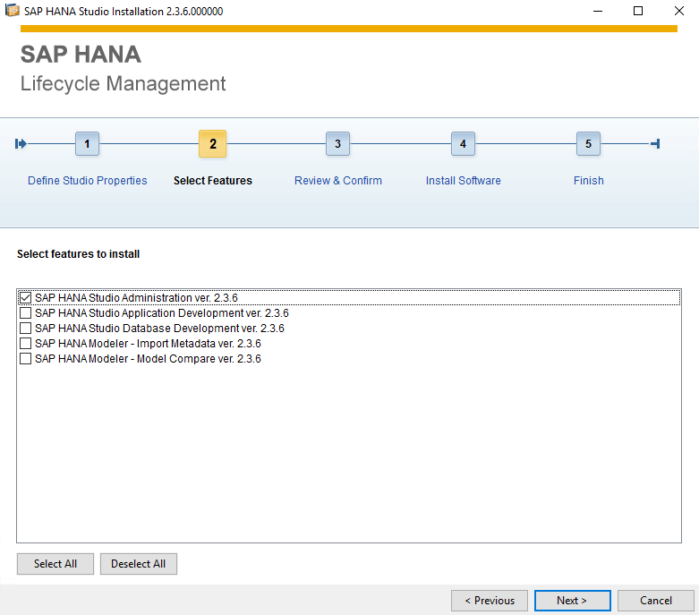

6.  On the **Review & Confirm** page, click **Install**

    

7.  On the **Finish** page, click **Finish**

    

### Task 2: Modify Azure Internal Load Balancer configuration

The template-based deployment of Azure components that form the SAP HANA infrastructure configures load balancer with the default value of its Health Probe ports and load balancing rules set for the instance 03 of SAP HANA. In this task, you will modify the load balancer configuration in order to account for the fact that you deployed instance 00.

1.  From the lab computer, in the Internet Explorer window / Azure portal, navigate to the **s03-lb-db** load balancer. Then, on the **s03-lb-db** blade, click **Health probes**.

    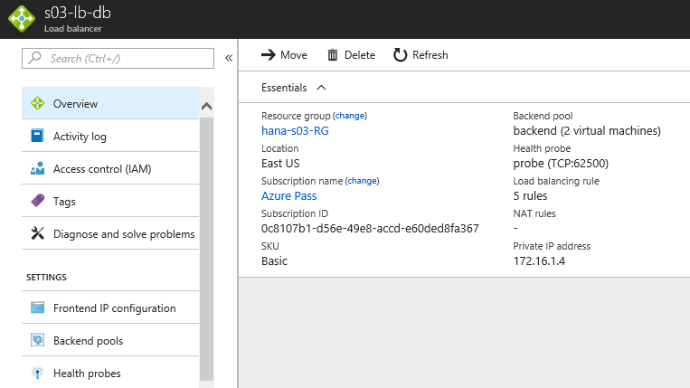

2.  On the **s03-lb-db -- Health Probes** blade, click **probe**

    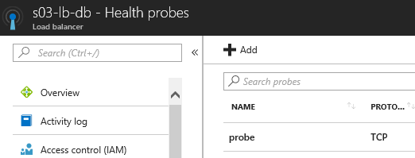

3.  On the **probe** blade, set the port to **62500**, and click **Save**

    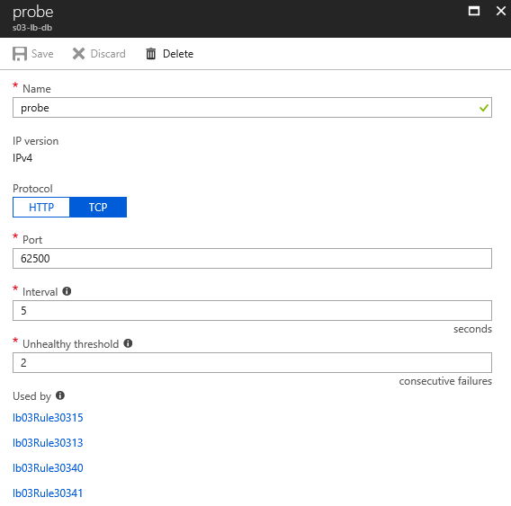

4.  On the **probe** blade, click the link to the **lb03Rule30315**. This will display the **l03Rule30315** blade.

5.  On the **lb03Rule30315** blade, change the name of the rule to **lb03Rule30015**, set both the port and the backend port entries to **30015**, and click **Save**

    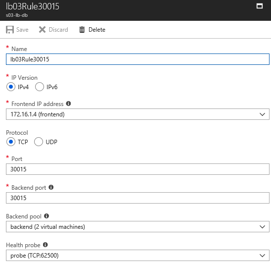

6.  Repeat steps 4 - 5 for the remaining rules **lb03Rule30313**, **lb03Rule30340**, **lb03Rule30341**, and **lb03Rule30342**, replacing for each **03** to **00**

### Task 3: Connect to HANA cluster by using SAP HANA Studio Administration

1.  From the Remote Desktop session to s03-hana-0, start **Notepad**, and open the **hosts** file located in **C:\\Windows\\System32\\drivers\\etc**

2.  Add the following entries to the host file, save your changes, and close the file:

    ```
    172.16.1.10	s03-db-0
    172.16.1.11	s03-db-1
    172.16.1.4	s03-db-ha-01
    ```

3.  From the Remote Desktop session, start SAP HANA Studio Administration

4.  When prompted to select a workspace, accept the default value, and click **OK**

    

5.  When prompted to provide a password hint, click **No**

    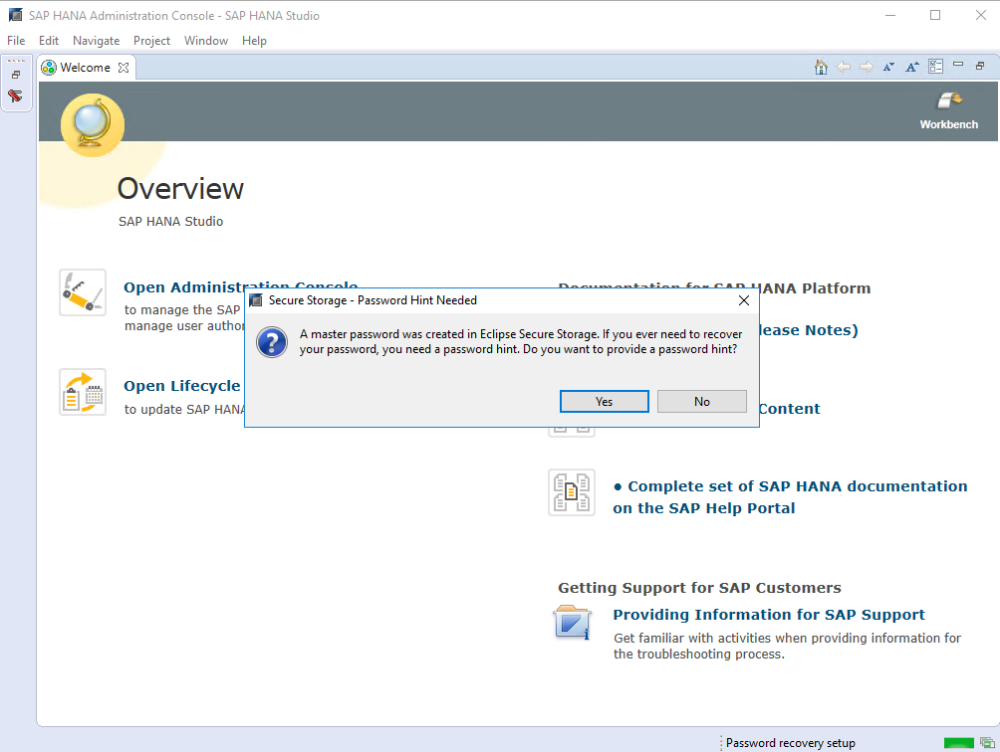

6.  On the **Overview** page, click **Open Administration Console**

    

7.  In the **SAP HANA Administration Console**, expand the **Systems** menu, and click **Add System**

    

8.  In the Specify System dialog box, specify the following information, and click **Next**

    -   Host Name: **s03-db-ha-01**

    -   Instance number: **00**

        

9.  In the **Connection Properties** dialog box, select the **Authentication by database user** option, specify the following information, and click **Finish**

    -   User Name: **SYSTEM**

    -   Password: **Demo\@pass123**

        

10. Once you successfully connected to **S03** as **SYSTEM**, click the **System Monitor** icon in the Systems toolbar

    

11. Review the **System Monitor** status

    

12. Right click the **S03 (SYSTEM)** node and in the right click menu. Click **Configuration and Monitoring** followed by **Open Administration**.

    

13. In the **Configuration and Monitoring** view, examine the **Overview** tab. Verify that all services are started, active, and in sync. You might need to wait a few minutes before the operational status is identified.

    

14. Switch to the **Alerts** tab, and verify they are not indicating any operational issues

    

### Task 4: Connect to HANA cluster by using Hawk

1.  From the Remote Desktop session, to s03-hana-0 Azure VM, start **Internet Explorer**, and browse to **https://s03-db-0:7630**. On the **SUSE Hawk Sign in** page, sign in as **hacluster** with the password **demo\@pass123**.

    

2.  Once you sign in, review the **Nodes** tab on the **Status** page

    

3.  Next, switch to the **Resources** tab on the **Status** page

    

4.  Examine the state of the HANA resources starting with the **SAPHANATopology**

    

5.  Examine the state of the **SAPHana** resource

    

### Task 5: Test a manual failover (from s03-db-0 to s03-db-1)

1.  From the Remote Desktop session, to **s03-hana-0** Azure VM, in the Internet Explorer window displaying the **SUSE Hawk** page, from the **msl\_SAPHana\_S03\_HDB00** page, identify the system currently serving the master role.

    

    Switch to the SSH session on s03-db-0, and stop the pacemaker service by running **service pacemaker stop** (This will trigger the failover of the **SAPHana** clustered resource.)
    
     ```
     s03-db-0:~ # service pacemaker stop
     ```

2.  Wait until the status of the resource changes from the question mark

    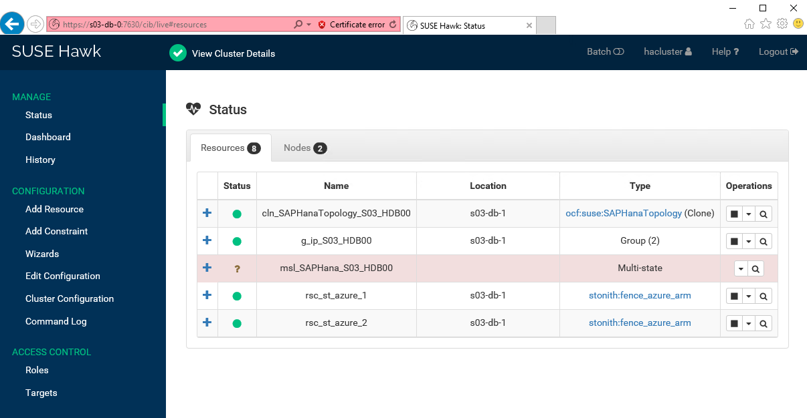

3.  Start **Internet Explorer**, and browse to **https://s03-db-1:7630**. On the **SUSE Hawk Sign in** page, sign in as **hacluster** with the password **demo\@pass123**.

4.  In the Internet Explorer window displaying the **SUSE Hawk** page, from the **msl\_SAPHana\_S03\_HDB00** page, identify the system currently serving the master role. Verify that its location changed to **s03-db-1**:

    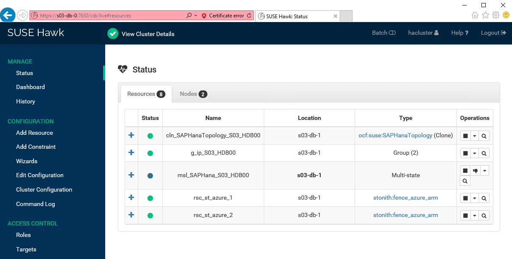

5.  Switch to **SAP HANA Administration Console**, and refresh the Overview tab in the **Configuration and Monitoring** view. Note that SAP HANA is running at this point on the **s03-db-1** node, and it is operational:

    

6.  After the failover, switch to the SSH session on s03-db-0, and start the pacemaker service by running **service pacemaker start**

    ```
     s03-db-0:~ # service pacemaker start
    ```

7.  Switch to the **SUSE Hawk Status** page, and note that the **SAPHana** clustered resource on s03-db-0 failed to start as secondary (This is because **AUTOMATED\_REGISTER** property was set to **false** in Exercise 6 Task 6.):

    

8.  To remediate this, switch to the SSH session on s03-db-0, and reconfigure the HANA instance as secondary by running the following sequence of commands:

    -   **su -- s03adm** (switch to the s03adm security context)

    -   **sapcontrol --nr 00 --function StopWait 600 10** (stop the HANA instance in case it is running)

    -   **hdbnsutil -sr\_register \--remoteHost=s03-db-1 \--remoteInstance=00 \--replicationMode=sync \--name=SITE1** (register the local instance as secondary)

    -   **exit** (switch back to the root)

    -   **crm resource cleanup msl\_SAPHana\_S03\_HDB00 s03-db-0** (clean up the failed state)
    
    ```
     s03-db-0:~ # su - s03adm

     s03adm@s03-db-0:/usr/sap/S03/HDB00> sapcontrol -nr 00 -function StopWait 600 10

     23.11.2017 12:51:16

     Stop

     OK

     23.11.2017 12:51:16

     StopWait

     OK

     s03adm@s03-db-0:/usr/sap/S03/HDB00> hdbnsutil -sr_register --remoteHost=s03-db-1 --remoteInstance=00 --replicationMode=sync --name=SITE1

     adding site ...

     --operationMode not set; using default from global.ini/[system_replication]/operation_mode: delta_datashipping

     checking for inactive nameserver ...

     nameserver s03-db-0:30001 not responding.

     collecting information ...

     updating local ini files ...

     done.

     s03adm@s03-db-0:/usr/sap/S03/HDB00> exit

     logout

     s03-db-0:~ # crm resource cleanup msl_SAPHana_S03_HDB00 s03-db-0

     Cleaned up rsc_SAPHana_S03_HDB00:0 on s03-db-0

     Waiting for 1 replies from the CRMd. OK
    ```

9.  Switch to the **SUSE Hawk Status** page, and note the **SAPHana** clustered resource is operational on both s03-db-0 and s03-db-1 with s03-db-1 as the primary:

    

### Task 6: Test a migration (from s03-db-1 to s03-db-0)

1.  From the SSH session on s03-db-1, migrate the **SAPHana** master node and the group containing the virtual IP address of the cluster to **s03-db-0** by running the following commands:

    -   **crm resource migrate msl\_SAPHana\_S03\_HDB00 s03-db-0**

    -   **crm resource migrate g\_ip\_S03\_HDB00 s03-db-0**
    
    ```
     s03-db-1:~ # crm resource migrate msl_SAPHana_S03_HDB00 s03-db-0

     INFO: Move constraint created for msl_SAPHana_S03_HDB00 to s03-db-0

     s03-db-1:~ # crm resource migrate g_ip_S03_HDB00 s03-db-0

     INFO: Move constraint created for g_ip_S03_HDB00 to s03-db-0
    ```

2.  Switch to the **SUSE Hawk Status** page, and note the **SAPHana** clustered resource on s03-db-1 failed to start as secondary. This is because **AUTOMATED\_REGISTER** property was set to **false** in Exercise 6 Task 6.

    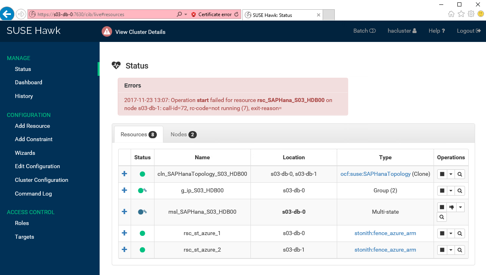

3.  To remediate this, switch to the SSH session on s03-db-1, and reconfigure the HANA instance as secondary by running the following sequence of commands:

    ```
    su - s03adm (switch to the s03adm security context)

    sapcontrol --nr 00 --function StopWait 600 10 (stop the HANA instance in case it is running)

    hdbnsutil -sr\_register \--remoteHost=s03-db-0 \--remoteInstance=00 \--replicationMode=sync \--name=SITE2 (register the local instance as secondary)

    exit (switch back to the root)
   
     s03-db-1:~ # su - s03adm

     s03adm@s03-db-1:/usr/sap/S03/HDB00> sapcontrol -nr 00 -function StopWait 600 10

     23.11.2017 13:22:33

     Stop

     OK

     23.11.2017 13:22:33

     StopWait

     OK

     s03adm@s03-db-1:/usr/sap/S03/HDB00> hdbnsutil -sr_register --remoteHost=s03-db-0 --remoteInstance=00 --replicationMode=sync --name=SITE2

     adding site ...

     --operationMode not set; using default from global.ini/[system_replication]/operation_mode: delta_datashipping

     checking for inactive nameserver ...

     nameserver s03-db-1:30001 not responding.

     collecting information ...

     updating local ini files ...

     done.

     s03adm@s03-db-1:/usr/sap/S03/HDB00> exit

     logout
    ```

4.  Switch to the **SUSE Hawk Status** page, click **Edit Configuration**. On **Edit Configuration** page, click **Constraints**.

    

5.  From the **Constraints** page, delete the **cli-prefer-g\_ip\_S03\_HDB00** constraint

    

6.  From the **Constraints** page, delete the **cli-prefer-msl\_SAPHana\_S03\_HDB00** constraint

    

7.  Switch to the SSH session on s03-db-1, and clean up the failed state by running **crm resource cleanup msl\_SAPHana\_S03\_HDB00 s03-db-1**:

    ```
     s03-db-1:~ # crm resource cleanup msl_SAPHana_S03_HDB00 s03-db-1

     Cleaned up rsc_SAPHana_S03_HDB00:0 on s03-db-1

     Waiting for 1 replies from the CRMd. OK
    ```

8.  Switch to the **SUSE Hawk Status** page, and verify the **SAPHana** clustered resource is operational on both nodes with s03-db-0 as the master

    

9.  Switch to **SAP HANA Administration Console**, and refresh the Overview tab in the **Configuration and Monitoring** view. Note that SAP HANA is running at this point on the **s03-db-0** node and is operational.

    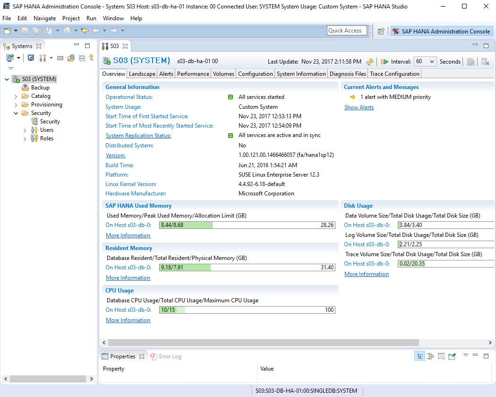

### Task 7: Test fencing

1.  From the SSH session on s03-db-0, shut down the eth0 network interface:

    ```
     s03-db-0:~ # ifdown eth0
    ```

2.  This will trigger restart of the Azure virtual machine, as you can verify it by checking its status from the Azure portal

    

3.  From the Remote Desktop session, switch to the *Internet Explorer** window displaying connection to **https://s03-db-1:7630**. Wait until the status of the resource changes from the question mark to a blue circle, and verify its location changed to **s03-db-1**.

    

4.  Switch to **SAP HANA Administration Console**, and refresh the Overview tab in the **Configuration and Monitoring** view. Note that SAP HANA is running at this point on the **s03-db-1** node.

    

5.  From the Azure portal, verify the s03-db-0 virtual machine is running

    

6.  Restart the SSH session to s03-db-0, and run the following commands in order to restore its operational status:

    ```
    su - s03adm (switch to the s03adm security context)

    sapcontrol --nr 00 --function StopWait 600 10 (stop the HANA instance in case it is running)

    hdbnsutil -sr_register --remoteHost=s03-db-1 --remoteInstance=00 --replicationMode=sync --name=SITE1 (register the local instance as secondary)

    exit(switch back to the root)

    crm resource cleanup msl_SAPHana_S03_HDB00 s03-db-0** (clean up the failed state)
    
     s03-db-0:~ # su - s03adm

     s03adm@s03-db-0:/usr/sap/S03/HDB00> sapcontrol -nr 00 -function StopWait 600 10

     23.11.2017 14:33:39

     Stop

     OK

     23.11.2017 14:33:39

     StopWait

     OK

     s03adm@s03-db-0:/usr/sap/S03/HDB00> hdbnsutil -sr_register --remoteHost=s03-db-1 --remoteInstance=00 --replicationMode=sync --name=SITE1

     adding site ...

     --operationMode not set; using default from global.ini/[system_replication]/operation_mode: delta_datashipping

     checking for inactive nameserver ...

     nameserver s03-db-0:30001 not responding.

     collecting information ...

     updating local ini files ...

     done.

     s03adm@s03-db-0:/usr/sap/S03/HDB00> exit

     logout

     s03-db-0:~ # crm resource cleanup msl_SAPHana_S03_HDB00 s03-db-0

     Cleaned up rsc_SAPHana_S03_HDB00:0 on s03-db-0

     Waiting for 1 replies from the CRMd. OK
    ```
    
7.  Switch to the **SUSE Hawk Status** page, and note that the **SAPHana** clustered resource is operational on both s03-db-0 and s03-db-1 with s03-db-1 as the primary

    

8.  Switch to **SAP HANA Administration Console,** and on the **Overview** tab in the **Configuration and Monitoring** view, click the **System Replication Status** link

    

9. From the System Replication tab, verify the replication status is active

    

## After the Hands-on lab 

Duration: 10 minutes

After completing the hands-on lab, you will remove the resource group and all its resources.

### Task 1: Remove the resource group containing all Azure resources deployed in this lab

1.  From the lab computer, in the Azure portal at <http://portal.azure.com> , click the **Cloud Shell** icon

2.  If prompted, in the **Welcome to Azure Cloud Shell** window, click **Bash (Linux)**

3.  At the Bash prompt, run the following:

    az group delete --name s03-hana-RG --no-wait --yes
    
You should follow all steps provided *after* the Hands-on lab.

