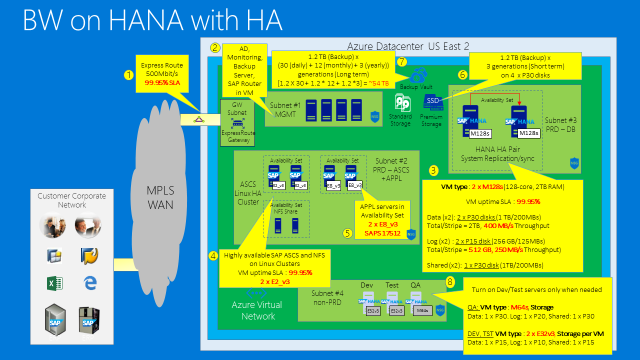
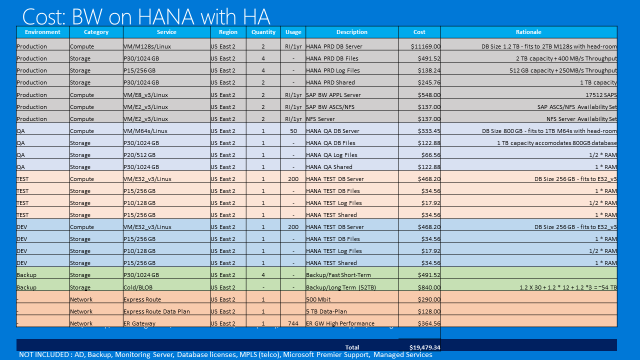

SAP HANA on Azure

 Whiteboard design session trainer guide

December 2017

Information in this document, including URL and other Internet Web site references, is subject to change without notice. Unless otherwise noted, the example companies, organizations, products, domain names, e-mail addresses, logos, people, places, and events depicted herein are fictitious, and no association with any real company, organization, product, domain name, e-mail address, logo, person, place or event is intended or should be inferred. Complying with all applicable copyright laws is the responsibility of the user. Without limiting the rights under copyright, no part of this document may be reproduced, stored in or introduced into a retrieval system, or transmitted in any form or by any means (electronic, mechanical, photocopying, recording, or otherwise), or for any purpose, without the express written permission of Microsoft Corporation.

Microsoft may have patents, patent applications, trademarks, copyrights, or other intellectual property rights covering subject matter in this document. Except as expressly provided in any written license agreement from Microsoft, the furnishing of this document does not give you any license to these patents, trademarks, copyrights, or other intellectual property.

The names of manufacturers, products, or URLs are provided for informational purposes only and Microsoft makes no representations and warranties, either expressed, implied, or statutory, regarding these manufacturers or the use of the products with any Microsoft technologies. The inclusion of a manufacturer or product does not imply endorsement of Microsoft of the manufacturer or product. Links may be provided to third party sites. Such sites are not under the control of Microsoft and Microsoft is not responsible for the contents of any linked site or any link contained in a linked site, or any changes or updates to such sites. Microsoft is not responsible for webcasting or any other form of transmission received from any linked site. Microsoft is providing these links to you only as a convenience, and the inclusion of any link does not imply endorsement of Microsoft of the site or the products contained therein.

© 2018 Microsoft Corporation. All rights reserved.

Microsoft and the trademarks listed at https://www.microsoft.com/en-us/legal/intellectualproperty/Trademarks/Usage/General.aspx are trademarks of the Microsoft group of companies. All other trademarks are property of their respective owners.

**Contents**

<!-- TOC -->

- [Trainer information](#trainer-information)
    - [Role of the trainer](#role-of-the-trainer)
    - [Whiteboard design session flow](#whiteboard-design-session-flow)
    - [Before the whiteboard design session: How to prepare](#before-the-whiteboard-design-session-how-to-prepare)
    - [During the whiteboard design session: Tips for an effective whiteboard design session](#during-the-whiteboard-design-session-tips-for-an-effective-whiteboard-design-session)
- [SAP HANA on Azure whiteboard design session student guide](#sap-hana-on-azure-whiteboard-design-session-student-guide)
    - [Abstract and learning objectives](#abstract-and-learning-objectives)
    - [Step 1: Review the customer case study](#step-1-review-the-customer-case-study)
        - [Customer situation](#customer-situation)
        - [Customer needs](#customer-needs)
        - [Customer objections](#customer-objections)
        - [Infographic for common scenarios](#infographic-for-common-scenarios)
    - [Step 2: Design a proof of concept solution](#step-2-design-a-proof-of-concept-solution)
    - [Step 3: Present the solution](#step-3-present-the-solution)
    - [Wrap-up](#wrap-up)
    - [Additional references](#additional-references)
- [SAP HANA on Azure whiteboard design session trainer guide](#sap-hana-on-azure-whiteboard-design-session-trainer-guide)
    - [Step 1: Review the customer case study](#step-1-review-the-customer-case-study-1)
    - [Step 2: Design a proof of concept solution](#step-2-design-a-proof-of-concept-solution-1)
    - [Step 3: Present the solution](#step-3-present-the-solution-1)
    - [Wrap-up](#wrap-up-1)
    - [Preferred target audience](#preferred-target-audience)
    - [Preferred solution](#preferred-solution)
    - [Checklist of preferred objection handling](#checklist-of-preferred-objection-handling)
    - [Customer quote (to be read back to the attendees at the end)](#customer-quote-to-be-read-back-to-the-attendees-at-the-end)

<!-- /TOC -->

# Trainer information

Thank you for taking time to support the whiteboard design sessions as a trainer!

## Role of the trainer

An amazing trainer:

-   Creates a safe environment in which learning can take place

-   Stimulates the participant's thinking

-   Involves the participant in the learning process

-   Manages the learning process (on time, on topic, and adjusting to benefit participants)

-   Ensures individual participant accountability

-   Ties it all together for the participant

-   Provides insight and experience to the learning process

-   Effectively leads the whiteboard design session discussion

-   Monitors quality and appropriateness of participant deliverables

-   Effectively leads the feedback process

## Whiteboard design session flow 

Each whiteboard design session uses the following flow:

**Step 1: Review the customer case study (15 minutes)**

Outcome: Analyze your customer's needs.

-   Customer's background, situation, needs and technical requirements

-   Current customer infrastructure and architecture

-   Potential issues, objectives and blockers

**Step 2: Design a proof of concept solution (60 minutes)**

Outcome: Design a solution and prepare to present the solution to the target customer audience in a 15-minute chalk-talk format.

-   Determine your target customer audience

-   Determine customer's business needs to address your solution

-   Design and diagram your solution

-   Prepare to present your solution

**Step 3: Present the solution (30 minutes)**

Outcome: Present solution to your customer.

-   Present solution

-   Respond to customer objections

-   Receive feedback

**Wrap-up (15 minutes)**

-   Review preferred solution

## Before the whiteboard design session: How to prepare

Before conducting your first whiteboard design session:

-   Read the Student guide (including the case study) and Trainer guide

-   Become familiar with all key points and activities

-   Plan the point you want to stress, which questions you want to drive, transitions, and be ready to answer questions

-   Prior to the whiteboard design session, discuss the case study to pick up more ideas

-   Make notes for later

## During the whiteboard design session: Tips for an effective whiteboard design session

**Refer to the Trainer guide** to stay on track and observe the timings.

**Do not expect to memorize every detail** of the whiteboard design session.

When participants are doing activities, you can **look ahead to refresh your memory**.

-   **Adjust activity and whiteboard design session pace** as needed to allow time for presenting, feedback, and sharing

-   **Add examples, points, and stories** from your own experience. Think about stories you can share that help you make your points clearly and effectively.

-   **Consider creating a "parking lot"** to record issues or questions raised that are outside the scope of the whiteboard design session or can be answered later. Decide how you will address these issues, so you can acknowledge them without being derailed by them.

***Have fun**! Encourage participants to have fun and share!*

**Involve your participants.** Talk and share your knowledge but always involve your participants, even while you are the one speaking.

**Ask questions** and get them to share to fully involve your group in the learning process.

**Ask first**, whenever possible. Before launching into a topic, learn your audience's opinions about it and experiences with it. Asking first enables you to assess their level of knowledge and experience, and leaves them more open to what you are presenting.

**Wait for responses**. If you ask a question such as, "What's your experience with (fill in the blank)?" then wait. Do not be afraid of a little silence. If you leap into the silence, your participants will feel you are not serious about involving them and will become passive. Give participants a chance to think, and if no one answers, patiently ask again. You will usually get a response.

# SAP HANA on Azure whiteboard design session student guide

## Abstract and learning objectives 

In this Whiteboard Design Session, you will look at what is involved in deploying SAP HANA on Azure with the goals of designing for high availability, disaster recovery as well as supportability.

At the end of this whiteboard design session you will be able to better design and deploy SAP HANA on Azure.

## Step 1: Review the customer case study 

**Outcome**

Analyze your customer's needs.

Timeframe: 15 minutes

Directions: With all participants in the session, the facilitator/SME presents an overview of the customer case study along with technical tips.

1.  Meet your table participants and trainer

2.  Read all of the directions for steps 1--3 in the student guide

3.  As a table team, review the following customer case study

### Customer situation

Contoso Group is a global pharmaceutical company with its headquarters based in Boston, US.

Contoso has been using SAP ERP and BW on HANA for its Finance/Logistics/Analytics systems on the HP-UX/Oracle platform.

Contoso Leadership and Planning Groups wants to drastically reduce server and storage hardware in their own datacenters to minimize IT related costs. Contoso has already a number of their non-SAP systems migrated to Azure. The leadership asked Contoso IT to look into the possibility of migrating its SAP HANA environment to cloud.

Contoso IT decided to leverage its knowledge of the Microsoft cloud platform and existing ExpressRoute connectivity and host its SAP landscape in Azure. The intention is to migrate the BW system first (go live in August CY18), and migrate ECC in Q4 of CY18. The multi-stage approach is supposed to minimize potential migration risks.

Considering that Contoso management team often uses BW to support their management decisions, the systems should be highly available, and their performance must be predictable and consistent. In addition, the management team wants to leverage disaster recovery capabilities offered by Azure in order to ensure resiliency of the migrated environment in case the primary region hosting the new deployment becomes unavailable.

As Andrew Cross, CIO of Contoso Group emphasized this point by stating "Our operational dependencies on SAP applications force us to seek reasonably priced availability and disaster recovery capabilities for our production SAP HANA deployments."

Before migrating the production environment, Contoso wants to test its new deployment approach by provisioning training, development, test, and UAT environments in Azure.

### Customer needs 

-   Highly responsive systems with low network latency
-   In-memory database performance
-   High availability & disaster recovery
-   Enterprise data protection & security
-   Safe migration with downtime minimized
-   Access from HANA-based applications
-   Minimized cost

1.  Design scope:

    -   BW migration to HANA in Azure VMs

        -   Go-live date: March 2018

        -   Current BW (ABAP Unicode) on-premises with HP-UX/Oracle and application layer on Linux

        -   Customer requests flexible VM solution within Cloud to accommodate the BW workloads

            -   Use 1-year Reserved VM Instance option for Production VMs

    -   ERP is kept on-premises (with HP-UX/Oracle) until December 2018

        -   Data is transferred from ERP (on-premises) to BW (in Cloud) every hour

    -   (Option) Need to start to prepare for ERP migration to Cloud

2.  Target environment:

    -   Sizing

        -   Production (3-tier) with latest OS/DB fully certified and supported by SAP

            -   HANA sizing memory requirement 1.2 TB, estimate 1.9 TB in 3 years

            -   Throughput DB files at least 400MB/s \[/hana/data\]

            -   Throughput DB Log files at least 250MB/s \[/hana/log\]

            -   BW application servers: 15K SAPS

        -   Certification is NOT required for non-Prod

            -   QA (2-tier) HANA database server: 800 GB

            -   Dev, Test (both 2-tier) HANA database server(s): 256 GB

    -   Uptime -- Prod: 24x7, 744 hours/month, QA - 50 hours/month, DEV/Test - 200 hours/month

3.  High availability and disaster recovery

    -   Availability

        -   Both HA and Non-HA options need to be proposed

        -   With HA option, in case of server/storage issues, auto failover to complete within a few minutes, in case of a disaster recovery within 1 day

    -   Backup

        -   Long term backup -- use reasonable backup storage in Cloud

        -   Data loss not allowed

        -   HANA DB log backup taken every 30 minutes

        -   DB log backup to be kept for 1 day (DB restore to be fast)

        -   HANA DB full backup every night

        -   Daily HANA DB full backup to be retained for 1 month

        -   Monthly HANA DB full backup for 1 year, annual for 3 years

4.  End user access

    -   User locations -- 300 from US, 50 LATAM, 50 Europe, 30 Asia - all intranet

    -   Currently ExpressRoute is set up to Azure East US 2

    -   Response time needs to be minimized

### Customer objections 

1.  ECC remains on-premises until Dec CY18. How can we maintain integrations between ECC and BW?

2.  How much does Azure cost? Give us a few options (e.g. HA and non-HA, DR and non-DR).

3.  Do I have to pay for virtual machines when they are stopped?

4.  Can I automate the shutdown of virtual machines at periodic times of day?

### Infographic for common scenarios

SAP Certified Azure VMs

")

")

## Step 2: Design a proof of concept solution

**Outcome**

Design a solution and prepare to present the solution to the target customer audience in a 15-minute chalk-talk format.

Timeframe: 60 minutes

**Business needs**

Directions: With all participants at your table, answer the following questions and list the answers on a flip chart.

1.  Who should you present this solution to? Who is your target customer audience? Who are the decision makers?

2.  What customer business needs do you need to address with your solution?

**Design**

Directions: With all participants at your table, respond to the following questions on a flip chart.

*High-level solution architecture:*

1.  What should be the Azure region(s) where the solution will be deployed?

2.  Should the customer use a 2-tier and 3-tier architecture for its SAP deployment?

3.  How would you ensure that the high-availability and disaster recovery requirements are satisfied?

*Network design:*

1.  What should be the hybrid connectivity option?

2.  What should be the Azure virtual network design in order to maximize security?

*SAP deployment architecture:*

1.  What will be the configuration of the configuration of the application and database components of your solution?

2.  What Azure VM sizes do you intend to use?

3.  What other Azure resources will be part of your solution?

*Solution cost:*

1.  What is the estimated cost of your solution without HA/DR?

2.  What is the estimated cost of your solution with HA?

3.  What is the estimated cost of your solution with HA/DR?

**Prepare**

Directions: With all participants at your table: 

1.  Identify any customer needs that are not addressed with the proposed solution
2.  Identify the benefits of your solution
3.  Determine how you will respond to the customer’s objections

Prepare a 15-minute chalk-talk style presentation to the customer. 

## Step 3: Present the solution

**Outcome**
 
Present a solution to the target customer audience in a 15-minute chalk-talk format.

Timeframe: 30 minutes

**Presentation** 

Directions:
1.  Pair with another table
2.  One table is the Microsoft team and the other table is the customer
3.  The Microsoft team presents their proposed solution to the customer
4.  The customer makes one of the objections from the list of objections
5.  The Microsoft team responds to the objection
6.  The customer team gives feedback to the Microsoft team.
7.  Tables switch roles and repeat Steps 2–6

##  Wrap-up 

Timeframe: 15 minutes

Directions: Tables reconvene with the larger group to hear the facilitator/SME share the preferred solution for the case study.

##  Additional references

|    |            |
|----------|:-------------:|
| **Description** | **Links** |
| High Availability of SAP HANA on Azure Virtual Machines (VMs) | <https://docs.microsoft.com/en-us/azure/virtual-machines/workloads/sap/sap-hana-high-availability/> |
| HANA + NetWeaver HA on Azure VM | <https://docs.microsoft.com/en-us/azure/virtual-machines/workloads/sap/high-availability-guide-suse> |
| Scripted HANA deployment | <https://github.com/AzureCAT-GSI/SAP-HANA-ARM> |

# SAP HANA on Azure whiteboard design session trainer guide

## Step 1: Review the customer case study

-   Check in with your table participants to introduce yourself as the trainer

-   Ask, "What questions do you have about the customer case study?"

-   Briefly review the steps and timeframes of the whiteboard design session

-   Ready, set, go! Let the table participants begin

## Step 2: Design a proof of concept solution

-   Check in with your tables to ensure that they are transitioning from step to step on time

-   Provide some feedback on their responses to the business needs and design

    -   Try asking questions first that will lead the participants to discover the answers on their own

-   Provide feedback for their responses to the customer's objections

    -   Try asking questions first that will lead the participants to discover the answers on their own
    
## Step 3: Present the solution

-   Determine which table will be paired with your table before Step 3 begins

-   For the first round, assign one table as the presenting team and the other table as the customer

-   Have the presenting team present their solution to the customer team

    -   Have the customer team provide one objection for the presenting team to respond to

    -   The presentation, objections, and feedback should take no longer than 15 minutes

    -   If needed, the trainer may also provide feedback

## Wrap-up

-   Have the table participants reconvene with the larger session group to hear the facilitator/SME share the following preferred solution

##  Preferred target audience

Business Development Manager (BDM) or Application Sponsor (CFO)

-   Funds projects & apps

-   Most interested in public cloud

Business Unit IT / Developers (Director of SAP Business Analysts, Director of SAP Operations)

-   Reports to BDM and is responsible for coding and testing apps

-   Big influencer of public cloud strategy

Central IT (VP of IT Operations)

-   Reports into CIO and responsible for operating datacenter

-   Concerned about shadow IT created issues: security/compliance, server sprawl, and lack of control

## Preferred solution

Azure Virtual Machines -- BW on HANA without HA

Azure Virtual Machines -- BW on HANA without HA -- Cost estimate

Azure Virtual Machines -- BW on HANA with HA

Azure Virtual Machines -- BW on HANA with HA -- Cost estimate

SAP HANA HA on Azure VMs -- Setup Sequence

SAP HANA HA on Azure VMs -- Setup Sequence (detailed)

Azure virtual machines - BW on HANA with HA/DR

## Checklist of preferred objection handling

1.  ECC remains on-premises until Dec CY18. How can we maintain integrations between ECC and BW?

    -   Microsoft supports a hybrid solution, with symmetry between on-premises applications and those on the public cloud

    -   Windows Azure Virtual Network allows to create a logically isolated section in Azure and securely connect it to on premises datacenters

    -   ExpressRoute provides secure, high-bandwidth, low-latency connectivity between Azure and on-premises datacenters

2.  How much does Azure cost? Give us a few options (e.g. HA and non-HA, DR and non-DR).

    -   The proposed design offers three options:

        -   Non-HA

        -   HA with no DR

        -   HA and DR

    -   For mission-critical SAP applications using SAP HANA, high availability can be achieved through a highly resilient architecture with active and standby systems that have databases running with data replication. If a deployment is non-mission critical, it is possible to ensure high availability for just the data and spin up necessary compute on-demand in the event of a failure.

    -   Disaster recovery can leverage:

        -   Azure Site Recovery Services (A2A scenario)

            -   Replicates SAP application instance VMs and ASCS/SCS VMs to second SAP Azure region

            -   VMs in DR region regions are not up and running (no compute costs)

        -   SAP HANA System Replication in asynchronous replication mode

3.  Do I have to pay for virtual machines when they are stopped?

    -   Azure VM must be in the stopped (deallocated) state in order to avoid compute charges. If the VM is stopped it will continue to incur charges.

    -   Deallocating does not mean deleting the VM as it still exists in storage.

    -   You will still incur storage charge even if the VM is deallocated.

4.  Can I automate the shutdown of virtual machines at periodic times of day?

    -   Yes, this functionality is available directly from the Azure portal. Alternatively, you can use Azure Automation runbooks or custom Azure PowerShell and Azure CLI scripts to stop and deallocate any instance.

    -   The same tools can be used to start the instance on a scheduled time.

    -   Note that the built-in platform auto-shutdown functionality does not provide the draining functionality of application servers, so it is important to verify that these servers do not have any active tasks before initiating shutdown. This can be implemented by using Azure Automation or Azure functions.

## Customer quote (to be read back to the attendees at the end)

"Azure has provided high availability and disaster recovery capabilities for our production environment at a very reasonable price."

Andrew Cross, CIO, Contoso Group

